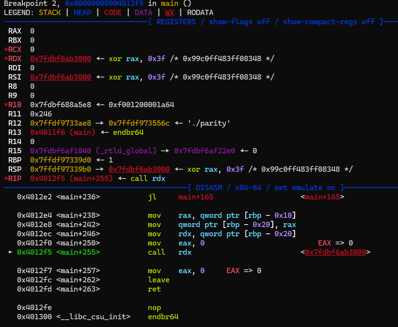
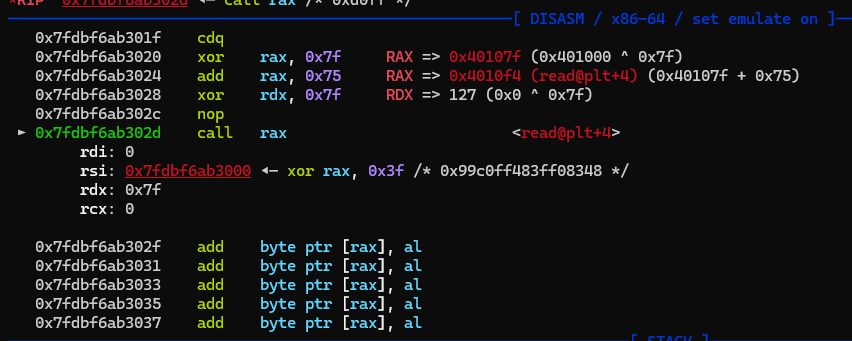

### parity

the binary is simple:


it is clear that you need to build a shellcode which the first byte is even, the second is odd, the third is even, etc...

i solved this chall by following this write-ups:
- https://github.com/TomasGlgg/CTF-Writeups/blob/master/angstromCTF%202022/parity/Writeup.md
- https://kuveee.github.io/posts/collection-shellcode/#parity-byte-ch%E1%BA%B5n-l%E1%BA%BB

i will explain ideas and summary learned tips:

the binary has no seccomp, so we will try to exec shell, but we can not perform `syscall` since it violate the binary rules (both are odd bytes):

```
0f 05                   syscall
```

so we will try to write a shellcode to call `read` into `buf` first. Then in the second input, we will call exec shell, which wont be filter by rules and easier for us.

set a breakpoint before it call our shellcode:



both `rdi = 0` and `rsi = buf` are satify for the `read`, we just need to modify `rdx` to be smaller

we using `nop` and `cdq` intructions to padding. `nop` is  `0x90` and `cdq` is `0x99`, both are 1 byte

we done set up register, but no `syscall` so we will call `read` via plt, modify `rax = read.plt` and `call rax`

if we success, its gonna be like this:



the next time program try to take our input, just directly give it `execve("/bin/sh", 0, 0)` shellcode, it wont be filter anymore. Also remember to padding so that the `/bin/sh` shellcode is lying right after when `read` is executed. 

the full exploit can be found in `ex.py` in the same folder...

### Tips

- Honestly i've found that any restricted shellcoding problem like this, its a lot easier to just call `read()` as quick as possible. Input the `read()` shellcode into `buf` to bypass the check function, then at the second read, input the exec shell shellcode with no filter...

- We can call some `plt` function via shellcode like this: modify `rax` to be the value of `function.plt` then `call rax`...