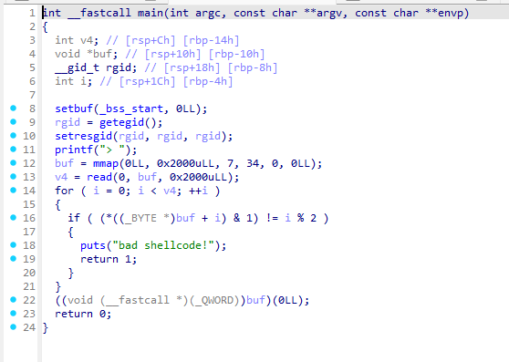

### parity

the binary is simple:

it is clear that you need to build a shellcode which the first byte is even, the second is odd, the third is even, etc...

i solved this chall following this write-ups:
- https://github.com/TomasGlgg/CTF-Writeups/blob/master/angstromCTF%202022/parity/Writeup.md
- https://kuveee.github.io/posts/collection-shellcode/#parity-byte-ch%E1%BA%B5n-l%E1%BA%BB

i will explain idea quickly:
- First, input the shellcode `read(0, buf, size)` that bypass the bad shellcode checks
- After `read` is executed, we input our second shellcode, that exec `/bin/sh`

### Tips

- Someone said "honestly i've found that any restricted shellcoding problem like this, its a lot easier to just call read as quick as possible", input the `read ` shellcode at buf first to pass the check function, then input the `binsh` shellcode after

- We can call some `plt` function via shellcode like this: modify `rax` to be the value of `function.plt` then `call rax`...