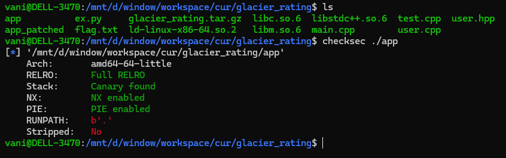
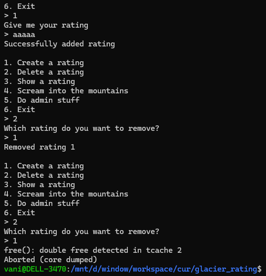
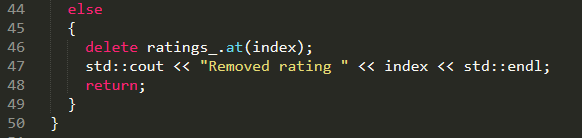
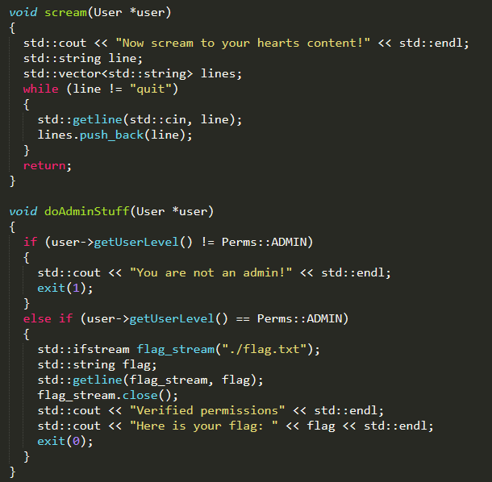
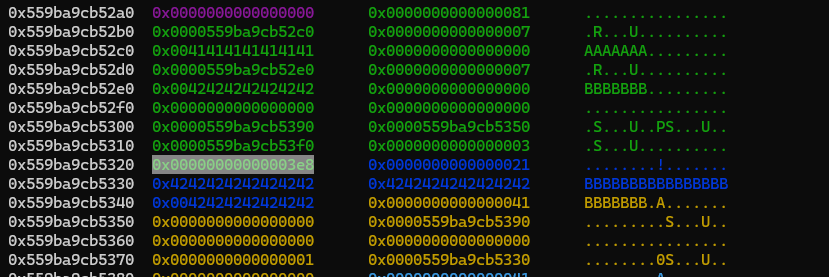
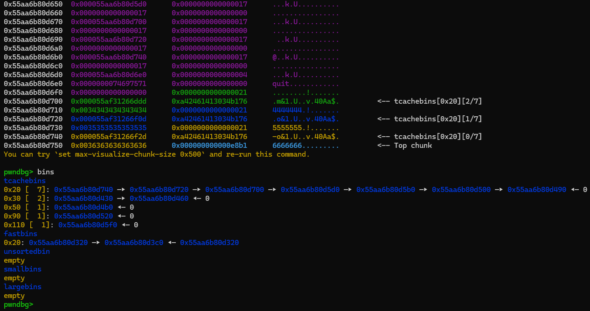

### glacier rating

was very cool and fun challenge, it's a c++ heap style chall...

the binary checksec:

source code files are given, so i won't talk about program flow details here

since the c++ chall involves many c++ structures and are hard to understand memory behaviour, i suggest you look at the cpp folder first...

when interacting with it, i spotted out when `delete a rating`, binary dont delete its `ptr` so technically we can free a rating twice...

looking through src code:

since the `User->rating_` is `std::map`, they should use `std::map::erase` funtion or anything similar...

there're also 2 interesting functions:

`doAdminStuff` will check user level if its admin (default is `1000`, admin is `0`) and directly print out the flag:

so our target is changing this value in heap memory...

the `scream` function, first i though it was useless, but after found out bugs and playing around with memory, i relized its help us easier to perform exploit

the function use a vector to insert as many strings as we want, the thing is when the function return, program will call vector's destruction function, which will deallocate those input strings

that means if we fengshui correctly (choose appropriate content strings's size), we can fill out corresponding tcache to make our double free work in fastbin, like this

then we just need to perform some fastbin posoining to get arbitrary malloc and change user level...

the full exploit can be found in the `ex.py` in the same folder...