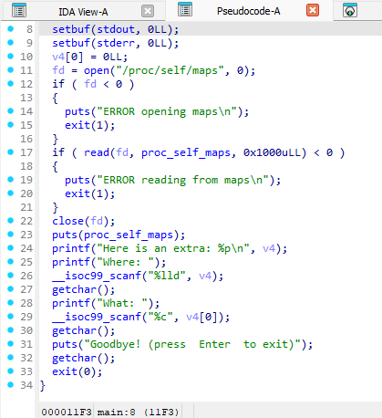

### write byte where

was a challenge i saw when reading nobodyisnobody docs...

i think its very interesting and worth to discuss.

the challenge was simple, give us usefule leak, and one time byte arbitrary write

the technique here is write that one byte on stdin's buf_end, to expand stdin buffer. Then next time program use function with stdin (in here, `getchar`), the data will be buffered, overwrite up to stdin's buf_end. That's means we can overwrite many interesting structure in libc region, eg stdout. We overwrite stdout to trigger fsop...

The reason i dont say details here because the chall's provied libc has no debug symbols. which is hard to explain:

>"The program was using an Alpine linux libc: glibc-2.38-2, and the authors only provided the stripped version, and as it was an old version I could not find the debug symbols for it, so it was a bit painful to debug. I did use the glibc-2.38-7 version for developing my exploit, which is the last version, and for which we can found the debug symbols. I had to adapt the offsets for the older version once my exploit worked." - nobodyisnobody

So i make i litte testing, which i will also explain more details. you can see it in fsop's pwn_demos folder

also, the full challenge's exploit can be found in the `ex.py` in the same folder...