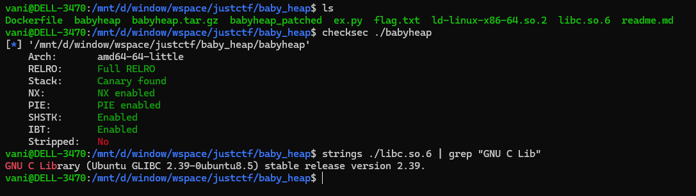
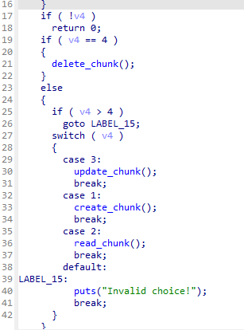
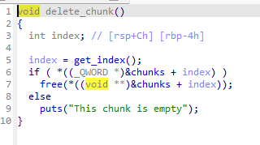

### baby heap

minimal chall but fun, easy to find bugs, but need patience to perform an exploit...

the binary compiled with glibc version `2.39` and full mitigations:

its note heap style chall:

and the bug is easy to found as i said, use after free as it doesnt clear pointer after delete:

this is the only bug we can abuse in this chall

honestly, first met the chall, after found the vuln, i can imagine all the exploit idea after 10 secs... not a flex, i just mean that the idea is straight forward

it maybe take times to explain all the code so i only write some key steps here:

> note that we are dealing with `glibc 2.39`

- abuse the use after free primitive, leak the `mangled ptr` of tcache bins -> decrypt it to leak heap base
- after have leak heap, we are able to perform tcache poisoning
- since we can only request `malloc` and `free` `0x40` chunks, we need to free a fake unsortedbin chunk to able to have a libc leak
- tcache poisoning to an other chunk's header, change it's size to unsortedbin range
- tcache poisoning to the end of that unsortedbin chunk, prepare some fake chunk to bypass the next adjacent chunk's checks (size and also next chunk of next chunk's size)
- free the fake unsortedbin chunk, abuse the uaf primitive -> leak libc
- after have libc leak, tcache poisoning to libc's `__environ` to leak stack
- after have stack leak, tcache poisoning to saved `rip` of program function and perform ROP chain

its just pure heap fengshui, precise heap layout control and fun...

this seem very sketchy, but you will find this exploit idea is very standard and maybe helpful at the future...

the full exploit can be found in the `ex.py` in the same folder...

