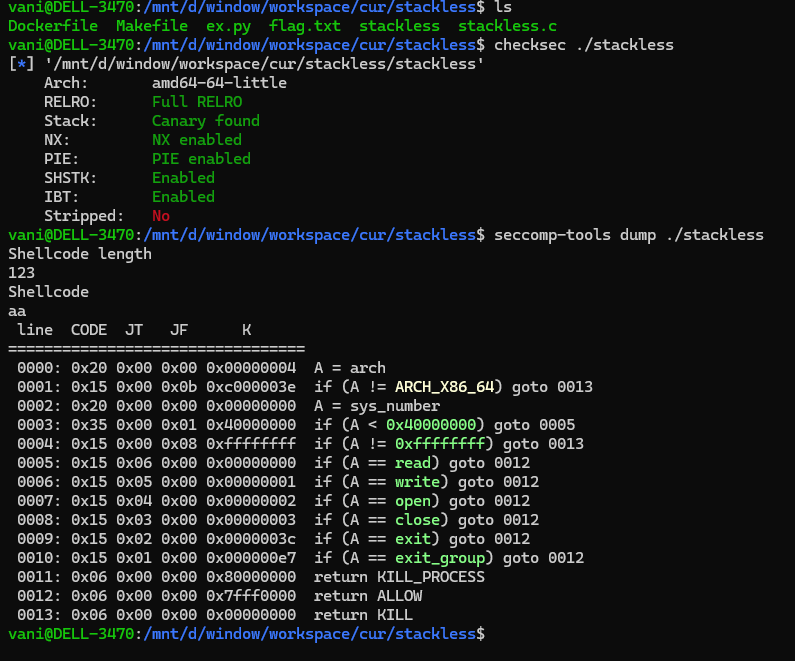
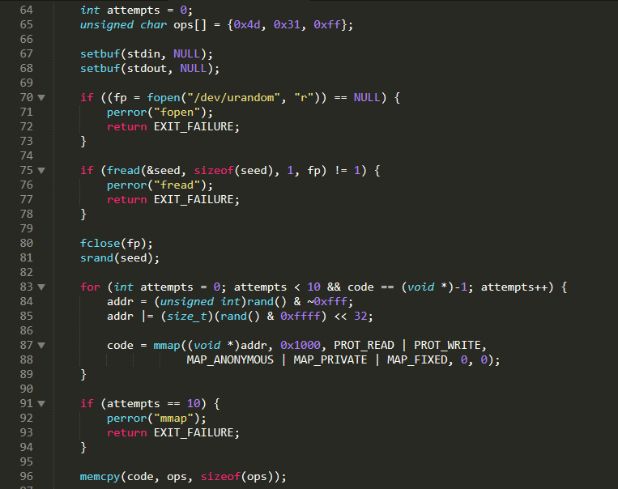
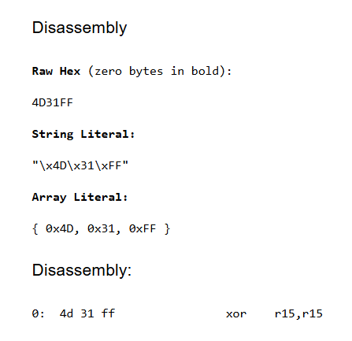
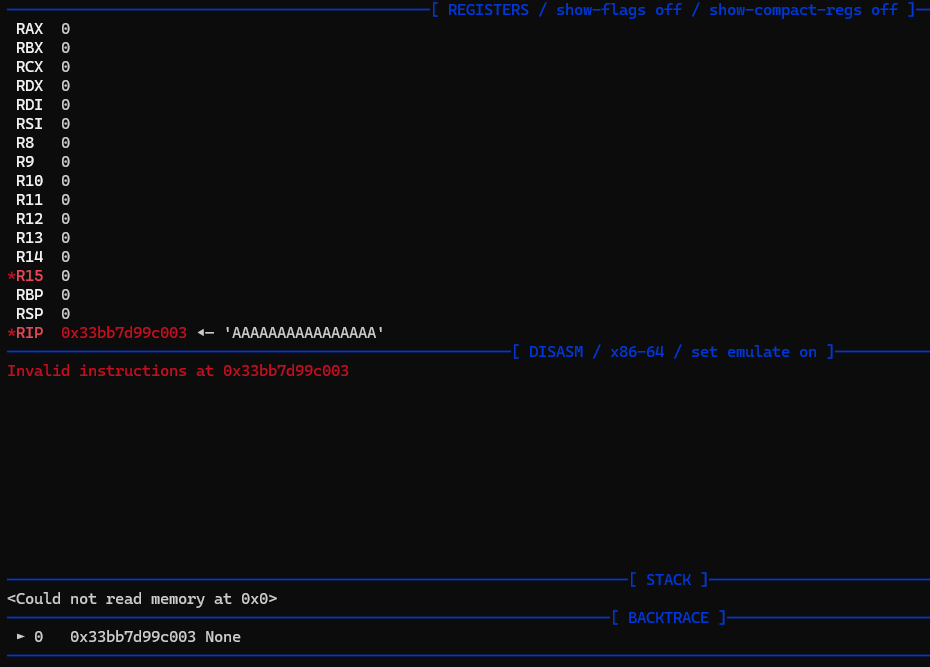
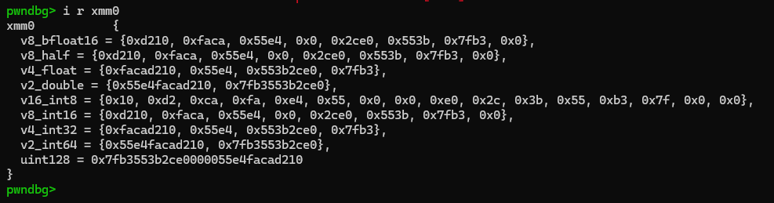
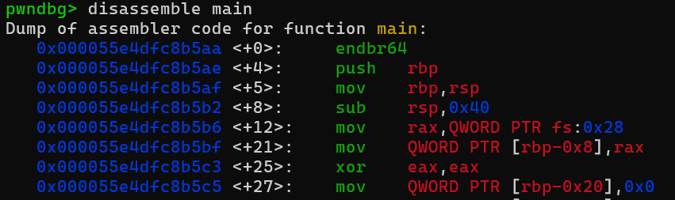
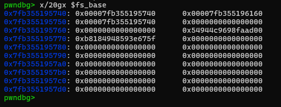

#### stackless

is interesting. After read some write ups, i found there are two ways to solve this challenge. First is some kind similar to side channel attack (i guess so), the second is what i will write here...

> but if you curious about the first one, you can find it [here](https://github.com/tj-oconnor/ctf-writeups/tree/main/nahamcon_ctf/stackless), very cool way

the binary checksec:



yeah probally `open read write` shellcode chall...

source code is given, no need ida here !



this part seem complicated, but believe me, it just try to mmap a random region with `r-xp` permissions (really really random i mean, you will understand if you debug it...). Then it add the `xor r15, r15` ins to the beginning of shellcode, just to make sure they clear out all registers before execute.



set a breakpoint before it execute our shellcode:



everythings zero-ed... We want to write a `open read write` shellcode, but the things is we dont have anywhere to put our flag at...

**We are blind, so we need a leak...**

#### using xmm register

> just read this tricks from nobodyisnobody's blog few days ago lol...

Libc functions are using xmm registers for many SIMD optimized functions, and you can find many useful addresses in them frequently: heap , libc, program, etc..

in restricted shellcodes often challenge's authors forget to clean them too, that's good for us, so we can find a heap address in `xmm0` actually which we can copy in `rax` register like this:

```
/* leak heap address */
movq rax, xmm0
```



also there are many other register `xmm0` -> `xmm15`, or even `ymm0` (bigger than `xmm`).... they are very interesting

#### using fs base

sound familiar ? `fs` base is actually represent for TLS. you already met it before, you just didnt notice:



that's is how program take canary value.

There are many useful values stored in TLS: canary, libc (not really that much)



both way (`xmm` and `fs`) will give us an leak - an read and write permission region - which we will put out flag on. eg like this:

```
mov rsi, qword ptr fs:0x0
mov rdx, 0x100
mov rax, 0
syscall
```

problem solved !

the full exploit can be found in the `ex.py` in the same folder...

### Tips

- Use `fs` or `xmm` whenever need a leak.
