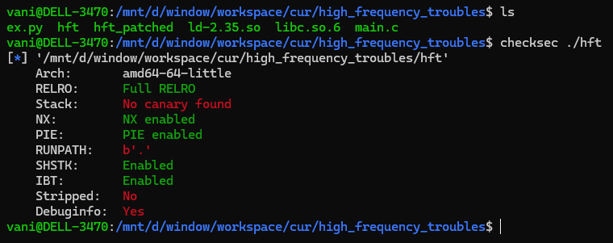
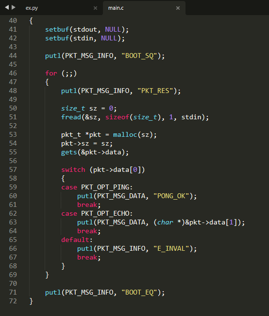
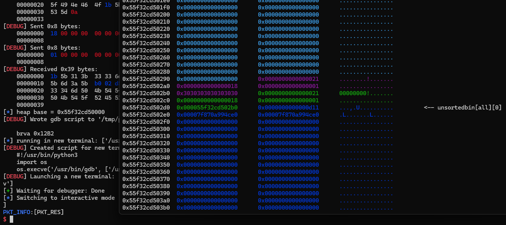
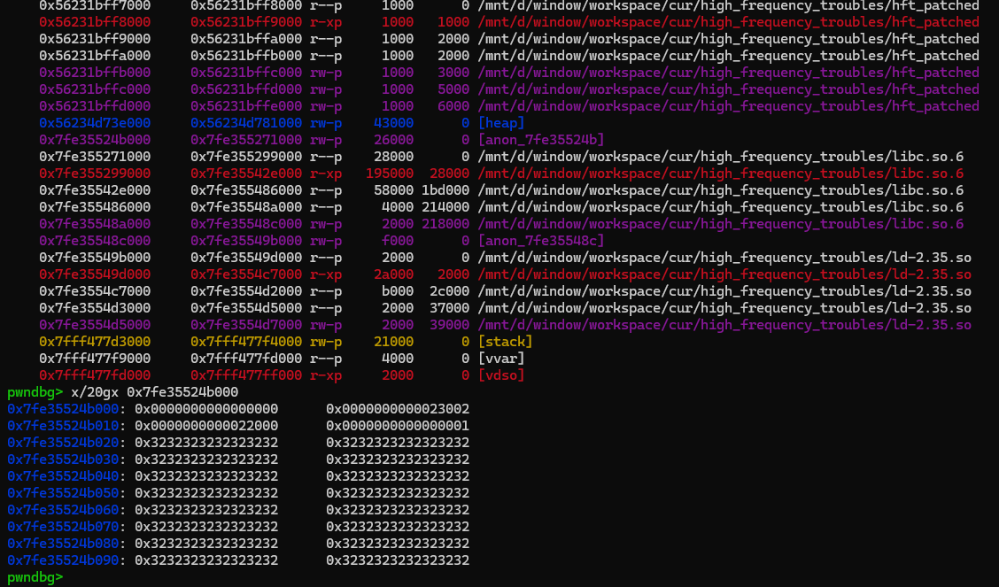

### high frequency troubles

was a heap challenge from picoCTF 2024, its worth to discuss...

the binary checksec:



we have provided source code, look through it we can say:

- the program have a endless loop with obiviously heap overflow
- no free function !



our first attemp is trying to leak something, heap base, libc base etc...

### leak heap

normally with heap problems, you need program call `free` in order to leak but there is no `free` option in binary... However, via `malloc` source code, there is a way to force program call `free` function. This technique has been described in `house of orange`, we overwrite `top_chunk` size to bypass check, then request a `malloc` bigger than that value, program will call `sbrk()` and `free` the old top chunk. For more details, please visit those links:
- https://4ngelboy.blogspot.com/2016/10/hitcon-ctf-qual-2016-house-of-orange.html
- https://ctf-wiki.mahaloz.re/pwn/linux/glibc-heap/house_of_orange/#the-correct-example

Lets say that we successfully free the old top chunk, i request a small `0x20` chunk and via some internal process with `last_remainder` (we dont need to care about this), there is a heap address value left over in heap region and the binary directly print out it for us (**example**):



### leak libc

this part involve another process...

when we request a `malloc` bigger than `mp_.mmap_threshold`, program will `mmap()` a new region, (oftenly) this region will under libc region, also under a TLS region



in TLS there is a variable call `tcache`  to determine where thread's tcache is located. 

```
pwndbg> info address tcache
Symbol "tcache" is a thread-local variable at offset 0x48 in the thread-local storage for `./libc.so.6'.
```

we have a big bof vuln, so via the `mmap` chunk, we can overflow to TLS, overwrite the `tcache` variable, take control of `tcache_per_thread`. Here i created a fake tcache entry chunk and overwrite with it's value... (you should find the offset by yourself...) (**example**)

```
pwndbg> x/gx tcache
0x55b66dc522f0: 0x0030003000300030
pwndbg> search -t qword 0x55b66dc522f0
Searching for an 8-byte integer: b'\xf0"\xc5m\xb6U\x00\x00'
[anon_7fdae6ec4] 0x7fdae6ee76f8 0x55b66dc522f0
```

in order to get a libc leak, i will overwrite tcache entry with old top chunk - now its unsortedbin chunk and have a libc address left over, then malloc program directly print out it for us...
### rce

remember that we can overwrite tcache entry with it's address itself, so we control it over and over again. Abusing this primitive we can easily can get arbitrary allocation. I choose leaking `__environ`, and allocation to stack and perform ROP...

the full exploit can be found in `ex.py` in the same folder...