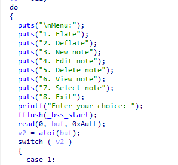
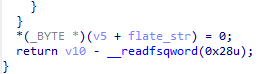
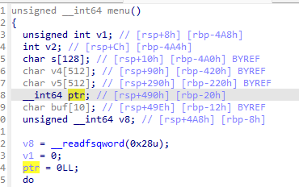
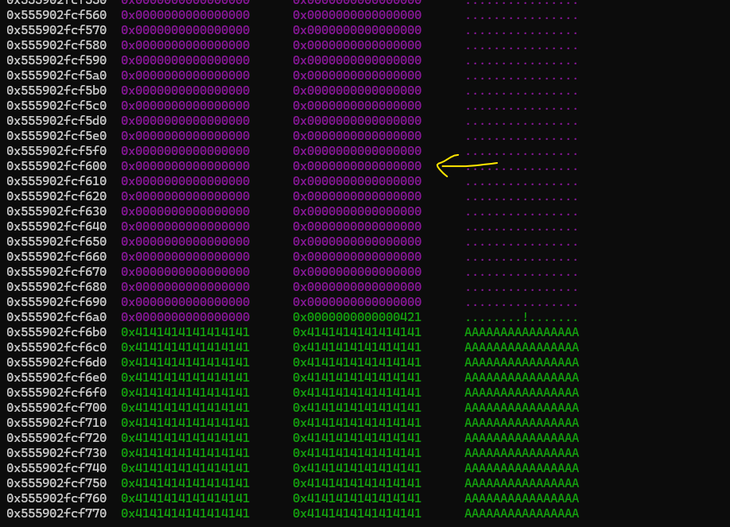
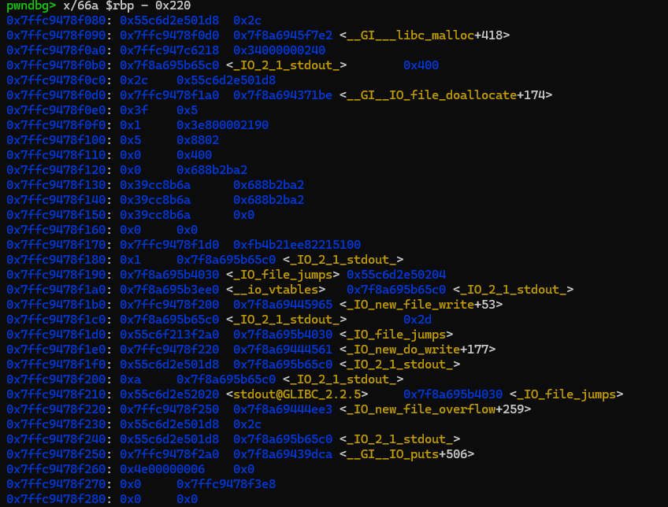
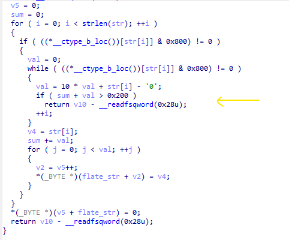
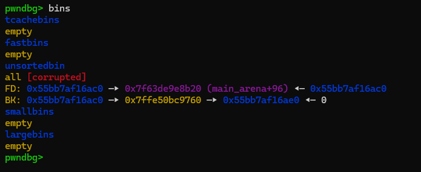
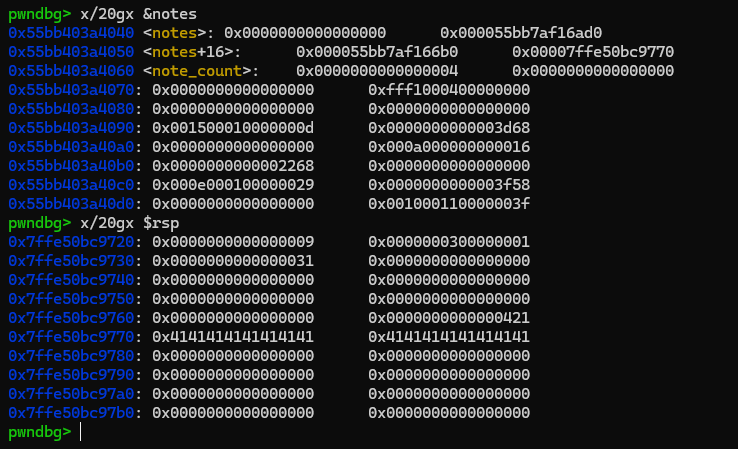

### compress

i didn't join pwnme ctf contest, after it ended, i read roberuto's writeups and found this chall quite interesting, not new thing to learn, but something worth to note...

> you can found full of his write up [here](https://robbert1978.github.io/2025/03/02/2025-3-3-PwnMe-Quals-2025/)

i won't write details here, just some important thing...

the binary is heap note style chall with full mitigations



`flate` and `deflate` function just simple means convert `1A2B3C` to `ABBCCC` and vice versa, you can understand deeper it if you reverse it...

at the end of `flate` function:



there is one terminate null byte, which can causes one byte off to current `ptr` variable if we interact carefully



example like this:


thats mean we can write from misalignment offset, that can take control over heap chunks's metatda



via this primitive we will allocate chunk into stack leveraging unsortedbin linked list...

> if you dont familiar with this, you can see in my `/heap/primitives/` folder

### leak part

first, for the leak part, we can easily notice that in the `flate` function, the result buffer is uninitialized, so its contain many interesting address:



look at `flate` function src code, when the `sum + val > 0x200`, function return directly, no null terminate



use this advantages, we can leak full address heap, libc, code, stack....

### unsortedbin poisoning

after have leaks, we need to create some fake chunk to get arbitrary allocation.

i dont talk details here (pls look at the heap folder first), but this is summary

First make a chunk goes to unsortedbin chunk, which we can control it's metadata, call it `chunk1`. Now we have 

```
chunk1 -> size = 0x3f0
chunk1 -> fd = main_arena
chunk1 -> bk = main_arena
```

and both `main_arena` pointer point back to `chunk0`

we will create 2 other fake chunks, first is `target` which is in stack. And second, the `chunk2` and set up their pointer like this:

```
chunk1 -> size = 0x3f0
chunk1 -> fd = main_arena
chunk1 -> bk = target

target -> size = 0x420
target -> fd = chunk1
target -> bk = chunk2

chunk2 -> size = ? (anything >= 0x20 (doesnt matter))
chunk2 -> fd = target
chunk2 -> bk = ? (anything (doesnt matter))

all the chunks must pass the adjacent's chunk check (size and prev_size)
```

if we success, bins layout will look example like this:



when we request for `0x420` chunk, program will goes through unsortedbin and find for exact fit, which is our fake chunk, and get allocation



> yes after the allocation bins will corrupted...

then use the off by one again, if we lucky, we can misaligned ptr to overwrite return address of `edit` function (requires brute forces)

the full exploit can be found in the `ex.py` in the same folder...

### attention

first time perform unsortedbin poisoning, i was trying to set up exactly with the docs in `/heap/primitives`...

but roberuto found a very smart way, which is simple to set up (very outstanding)

a message to myself, i need to be more flexible, i guess...