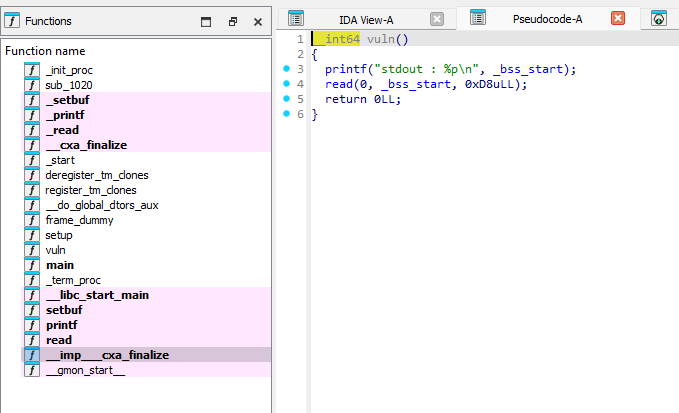
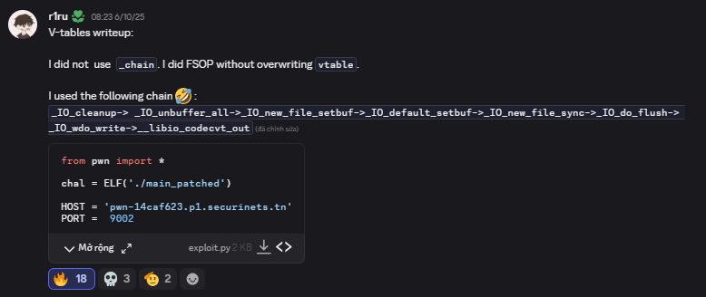

### v_tables

was one of my favourite fsop challenge from secuninet ctf

compiled with `glibc 2.41`, the challenge give us control of stdout and free libc leak

howerver, we can not reach to `vtable` because of we only have `0xd8` length overwrite, this is trivial, because many fsop involved hijacking the vtable to trigger fsop path

in here i will write down 2 solution, one was mine and one of `r1ru`  which is very outstanding

### my solution: attack `_chain` field, create a fake file struct overlapped with `stdout`

we can easily see that the program return right after overwrite `stdout` (this is important, if there is a `puts()` there, i dont think this challenge can be solved)

when the program return from main or `exit()`, it will call the `_IO_cleanup` function in progress

attack the `_chain` field idea is the same as attack `_IO_list_all` which is already describe in [here](/fsop/pwn_demos/io_list_all/readme.md)

i choose to use this path of niftic blog: https://niftic.ca/posts/fsop/#_io_wdoallocbuf43 (or pwncollege path, because an3eii contrainst is stricter and hard to set up), and set the fake fp at `[stdout-0x10]` (so the `_flag` can be `0`) 

all we need to do is set up field for file struct, the binary compiled with stripped `debian` glibc `2.41`, so debug to set up is pain, i adapt with reading asm and navigate through online glibc src code in here https://elixir.bootlin.com/glibc/glibc-2.41/source/libio/genops.c#L711 , so i wont write detail here, you should do it by urself

then problems come, we can hijack the `rip` but cannot control the `rdi`, since it point to `fp` (which is now `[stdout-0x10]`) we dont have control of that data, after navigate the register value, i decide to hijack via one more time call `setcontext` gadget to control register, detail idea can be found from lkmidas's blog: https://lkmidas.github.io/posts/20210103-heap-seccomp-rop/#gadgets  (its a different problem but the `setcontext` usage is the same)

once again set up values to overlap with `0xd8` buffer and fake file struct and stdout is now even more painful, you can find my payload in `ex_vani.py` in the same folder

when contest is ongoing, i relize my payload has 50% success but to lazy to debug why, after its end, i found out just because my payload incidentally overwrite the `_mode` field which is trivial to trigger `_IO_OVERFLOW` (when `_mode <= 0`), however, its depend on aslr so its 1/2 success rate. Enjoy!

Also `f100w` has same method but set up different with mine, you can also see it in the same folder (its more cleaner i guess)...

### r1ru's solution: new advanced fsop path (specific case i think)

i dont explain details, you can explore it by urself (this is very dope, i will make an experiment about this later), here is some context

he ignored the `_IO_flush_all` and navigate `_IO_unbuffer_all`, set up a fp doenst requires `vtable` or chain `_field`, very goat, payload is even shorter than mine, his exploit in the same folder 

also i said it doesnt require `vtable`, it not mean `vtable` is ignored, we still somehow trigger rce via fake fp `vtable`, but no need to hijacking the original stdout vtable, i doubting if what will happen when we put a `puts` function at the end...