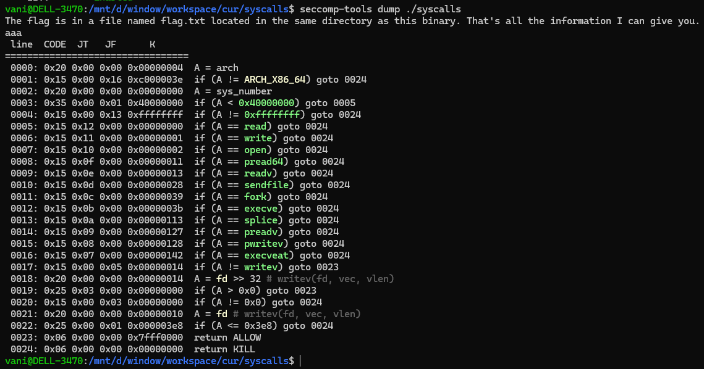

### syscalls

is a quite classic shellcode chall:

it has seccomp forbid some common function

No `execve` or `execveat` means no shell. Also the program let us know the flag file is at same dir. We need to perform some `open read write` shellcode

Since they are all forbiden, we neet to find some other function to replace them.

- `openat` instead of `open`
- `mmap` instead of `read`
- `writev` instead of `write`

Also there are some conditions to use `writev` as you can see in the seccomp, the file descriptor must be greater than `0x3e8`, so we need to perform `dup(1, 0x3e9)` before `writev` to make `0x3e9` become `stdout`.

Here i dont write details, but some notes to remind:

- When using `openat` if file path is relative, the `dirfd` must be `-100`

- `mmap` can also replace for `read`, you can watch this links for better understand:
	- https://linux.die.net/man/3/mmap
	- https://vimentor.com/vi/lesson/memory-mapping/
	
- create a fake `iovec` struct before call `writve`

If you met any problems, this 2 writeups can help:
- https://ctftime.org/writeup/39292
- https://kuveee.github.io/posts/collection-shellcode/#syscall

The full exploit can be found in the `ex.py` in the same folder

### Tips

- Flexible find others functions to replace the forbidden whenever met seccomp
- `mmap` can actually replace `read` lmfao.