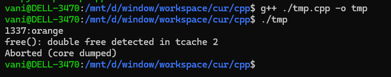
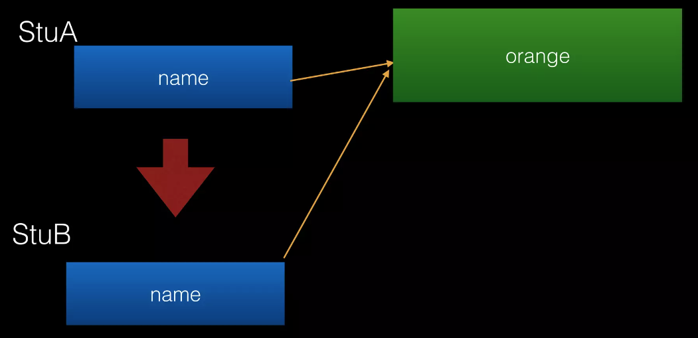
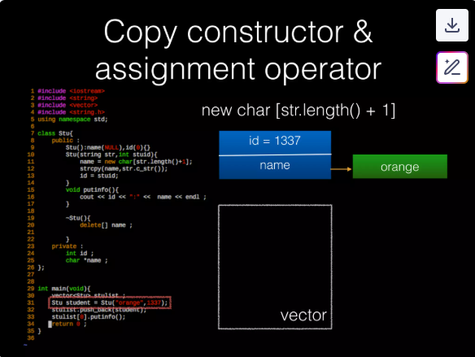
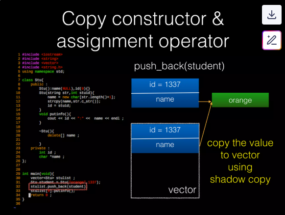
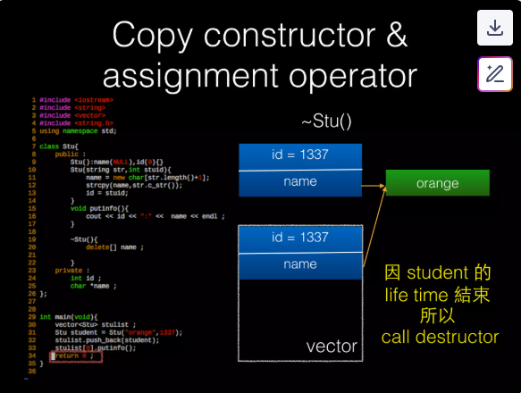
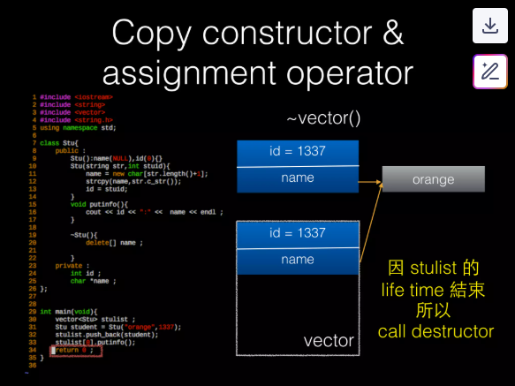
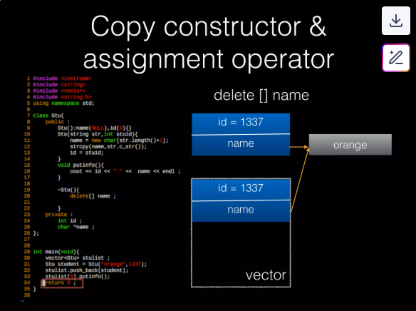
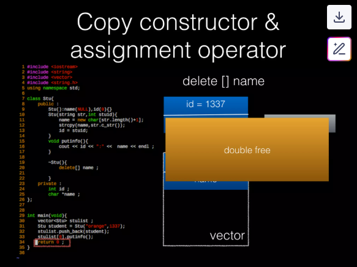

## Example

What's wrong in this code?

C++ (bug) source code:

```C++
#include <iostream>
#include <string>
#include <vector>
#include <string.h>

using namespace std;

class Stu{
    public : 
        Stu():name(NULL),id(0){}
        Stu(string str, int stuid){
            name = new char[str.length()+1];
            strcpy(name,str.c_str());
            id = stuid;
        }
        void putinfo(){
            cout << id << ":" << name << endl;
        }

        ~Stu(){
            delete [] name;
        }
    private :
        int id;
        char *name;
};

int main(void) {
    vector<Stu> stulist ;
    Stu student = Stu("orange",1337);
    stulist.push_back(student);
    stulist[0].putinfo();
    return 0;
}
```



## Shadow (shallow) copy & Deep copy

**Shallow Copy**:
- Only copies the raw pointer (value). After copying, the contents are the same as the original.
- 

**Deep Copy**:
- Allocates additional memory and also duplicates the contents pointed to by the pointer.
- 

> [useful?](https://www.geeksforgeeks.org/cpp/shallow-copy-and-deep-copy-in-c/)

## Copy Constructor & Assignment Operator

**Copy Constructor**:
- In C++, when copying an object, the copy constructor is used.
- When a class has pointer-type members, you usually need to implement the copy constructor manually.
- If not explicitly defined, the default copy constructor is used:
	- It performs a shallow copy only.
- When is the Copy Constructor used?:
	- `Stu student = Stu("dhaa")`
	- Passing by value: `func(Stu stu)`
	- Returning an object: `return stu`
	- STL containers like `vector`
	- …

**Assignment Operator**:
- In C++, when using the `=` operator on objects, the assignment operator function is used to assign one object to another.
- When a class has pointer-type members, you usually need to implement it manually.
- If not explicitly defined, the default assignment operator is used:
	- It performs a shallow copy only.
- When is the Assignment Operator used?:
	- `stuA = stuB`
	- STL containers like `vector`
		- Example: `vector.erase()`
	- ...

> [this](https://www.geeksforgeeks.org/cpp/copy-constructor-in-cpp/) and [this](https://www.geeksforgeeks.org/cpp/default-assignment-operator-and-references-in-cpp/) useful?

## Analyse bug code

#### Call constructor

```C++
Stu student = Stu("orange",1337);
/*
Stu(string str, int stuid){
    name = new char[str.length()+1];
    strcpy(name,str.c_str());
    id = stuid;
}
*/
```



#### Call `push_back`

```C++
stulist.push_back(student);
```



#### Call `return`

"Because the lifetime of student ends, the destructor is called.":
- Destructor `~Stu()` is called.
- Memory pointed to by `name` is released.




"Because the lifetime of `stulist` ends, the destructor is called. The vector will call the destructor of its contents one by one."
- Destructor `~vector()` is called.
- When vector is destroyed, it triggers destruction of elements inside the vector (one by one).
- The `~Stu()` destructor is called for each element.








#### Summary

In C++, whenever any copying action is performed, the copy constructor or assignment operator is typically used.

Therefore, if an object contains pointers, it is generally good practice to define both the copy constructor and assignment operator.
