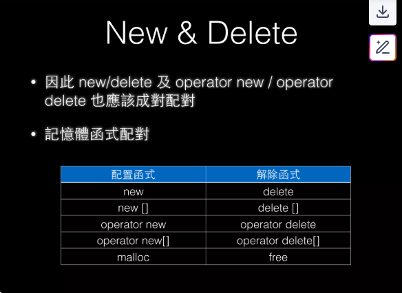

## New & Delete

In C++ by default, `new`/`delete` (at the lowest level) still rely on `malloc`/`free` for memory management.

In C++, the memory allocation pool is also called the free store, but under the default setup, the free store is located on the heap.

> [what is free store?](https://stackoverflow.com/questions/1350819/c-free-store-vs-heap)

Actually, `new`/`delete` can be overloaded, meaning you can implement custom memory management. The main difference is that `new`/`delete` will call constructors/destructors, while `malloc`/`free` only perform plain memory allocation.

> [constructor and destructor?](https://www.geeksforgeeks.org/cpp/difference-between-constructor-and-destructor-in-c/)

Therefore, you should **avoid mixing** `malloc`/`free` with `new`/`delete`, or it may cause unpredictable behavior.

## Compare

The general flow of `new`:
- `operator new`:
	- similar to `malloc`, it simply allocates memory. But if allocation fails, it throws an exception, whereas `malloc` returns null.
	- So `operator new` is like a wrapper over `malloc`
- constructor

The general flow of `delete`:
- destructor
- `operator delete`:
	- Similar to `free`, it deallocates memory. It's like a wrapper over `free`

> [useful?](https://www.geeksforgeeks.org/cpp/new-and-delete-operators-in-cpp-for-dynamic-memory/)
