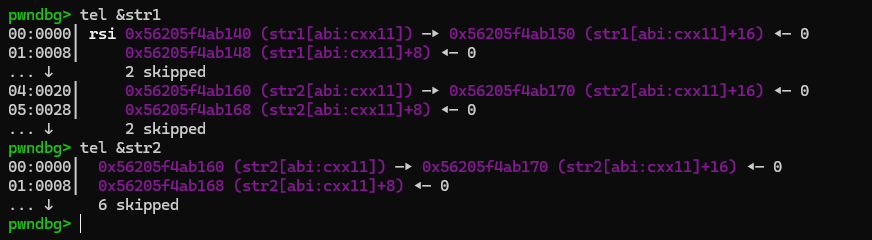
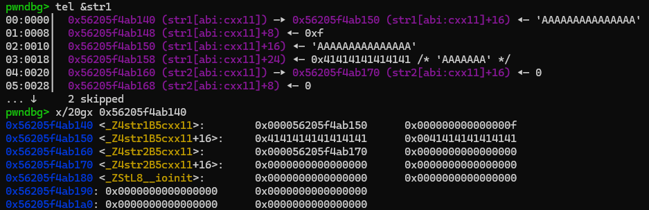
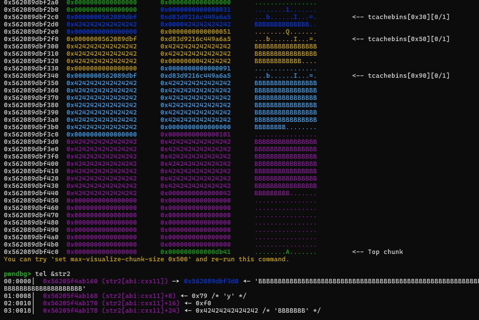
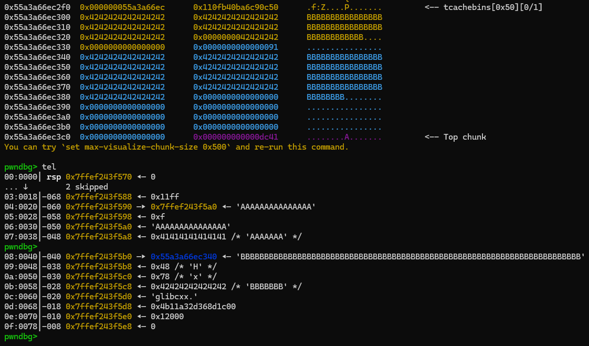
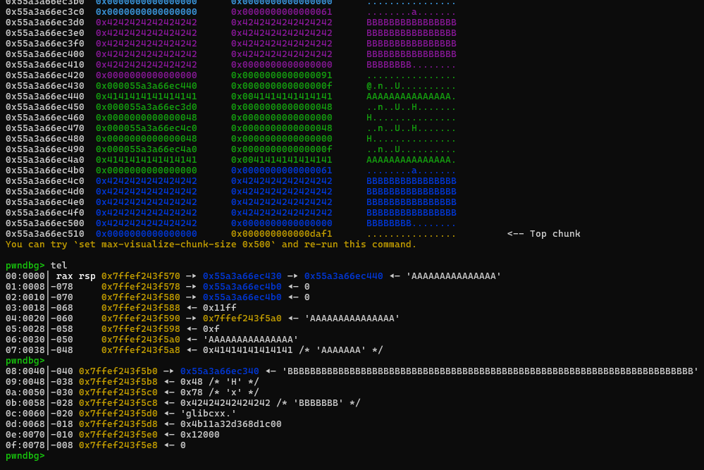
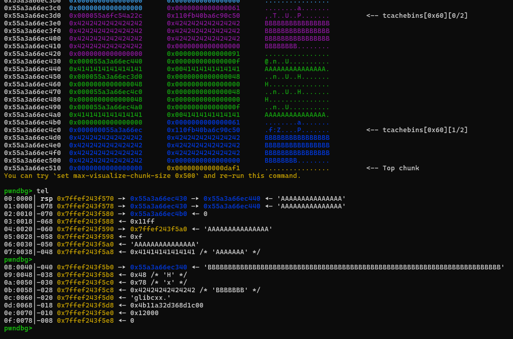

First, have to say, i'm writing this during reading [pwning in C++ basic](https://fr.slideshare.net/slideshow/pwning-in-c-basic/58370781#33) of angelboy. While debuging, i found out that string behaviour is different within slides. I figure out that its maybe because of different g++ versions...

> He must be used `g++ < 5` since there's still `refcnt` in his string structure, mine is `g++ 11.4`...

I adapted with my version, so my note will be different with him and explain might be missunderstood (I will try not to...), but i also added the links if you want deeper understand...

## String

is a dynamic char array, dynamically allocated to "prevent" BOF, safer than string array

when input (`cin >>`) is called, memory repeating reallocated for user until ends. The appropriate size will be returned.

> Just imagine, `cin >>` will malloc as much as needed...

## Demo string's member

can consider string is struct like this:

```C++
class imagine_string {
  char *    buffer;     //  ptr point to string characters
  size_t    size;       //  number of characters
  union {
      char small_buffer[16];
      size_t    capacity;   //  buffer size
  };
};
```

there are some **optimize** with string implement, you can read 2 this blog for further understand (very cool blogs), i will explain quickly with small demo:
- https://gist.github.com/0xdevalias/256a8018473839695e8684e37da92c25#stdstring
- https://shaharmike.com/cpp/std-string/

C++ source code:

```C++
#include <iostream>
#include <vector>
#include <string>
#include <string.h>

using namespace std;

string str1, str2;

int main(void){

    cin >> str1;

    cin >> str2;
   
    return 0;
}
```

#### After declaration

There is nothing, so `str`'s `size` is `0`. `buffer` point to `capacity`/`small_buffer` (also have null value):



#### Input `str1 = "A" * 15`

when `cin >>` string with `size <= 15`, the region after `size` will be considered as `small_buffer`

the program will directly stored our string there, so no need any allocation



now `str1`'s `buffer` point to `small_buffer`, `size = 0xf`.

#### Input `str2 = "B" * 0x79`

at the beginning, `capacity` is `0xf`, but now the `small_buffer` is no longer enough for input, so it will allocated memory from heap

it will double the `capacity` and request **suitable** chunk, `0xf * 2 = 0x1e`. If it still not enough,  repeating double `capacity` again and request until it has enough space, `0x1e -> 0x3c -> 0x78 -> 0xf0...`

> remember that i said double the `capacity` then request, not double the chunk size, the chunks 's size have formula too, you can guess it...

also during that, it will free previous unsuitable chunk (for reuse later, of course!)



as you can see here, `str2`'s buffer point to string `"B" * 0x79`, `size = 0x79`, `capacity = 0xf0` (as expected)

## (quick) Demo string behaviour with vector ?

> Fun to debug...

C++ source code:

```C++
#include <iostream>
#include <vector>
#include <string>
#include <string.h>

using namespace std;

int main(void){
    vector<string> vec;
    string a, b;
   
    cin >> a;
    cin >> b;

    vec.push_back(a);
    vec.push_back(b);
    vec.push_back(b);
    vec.push_back(a);

    vec.pop_back();
    vec.pop_back();
    vec.pop_back();
    vec.pop_back();

    return 0;
}
```

#### After input two strings

i input `a = "A" * 15` and `b = "B" * 0x48`



`a` is at `[rbp - 0x60]`, `b` is at `[rbp - 0x40]`, `vec` is at `[rsp]`

`a` and `b` are assigned values as expected, `vec` is uninitalize because now it still empty.

#### After 4 times push_back



`a`, `b`, `vec` are assigned values as expected.

**Interesting** thing here is, whenever vector `vec` push back string `b`, program will allocate new buffer to represent string `b`, **NOT** using the `b`'s real buffer (at `0x55a3a66ec340`)

#### After 4 times pop back



`a`, `b`, `vec` are assigned values as expected.

**Interesting** thing here is, whenever vector `vec` pop back the string `b`, program will free the buffer was created for represent (two `0x60` tcache chunk, in correct free (pop back) order).

