## Vector

is a dynamic array, **allocated in heap** segment. More flexible than arrays in C code.

> When there isn’t enough space, create `new` vector with **double the size**, and the old space is returned to the system.

## vector's member

- `_M_start` : vector's start position
> `vector::begin()`

- `_M_finish` : vector's end position
> `vector::end()`

- `_M_end_of_strorage` : last position of the container
> - use to check if there is enough space for element
> - if `_M_finish == _M_end_of_storage` in `push_back()`: allocate `new` space for vector

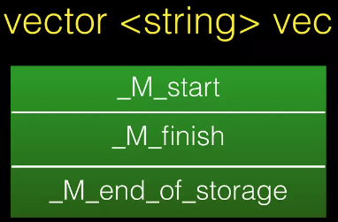

## vector's member function

- `.push_back()` : add new element into the end of the vector

- `.pop_back()` : remove the last element of vector

- `.insert()` : insert an element into n's position of the vector

- `.erase()` : remove n elements from vector

- [more...](https://cplusplus.com/reference/vector/vector/)

## Demo (vector's layout and behaviour)

C++ source code:

```C++
#include <iostream>
#include <vector>
#include <string>
#include <string.h>

using namespace std;

int main(void){
    vector<string> vec;
    vec.push_back("meh");
    vec.push_back("meheap");
    vec.push_back("meh.py");
    vec.push_back("pwn");
    vec.pop_back();
    vec.push_back("AAAAAAAAAAAAAAAAAAAAAAAAAAAAAAAAAAAAAAAAAAAAAAAAAAAAAAAAAAAAAAAA");

    return 0;
}
```

> compile by yourself...

#### After `vector` declaration

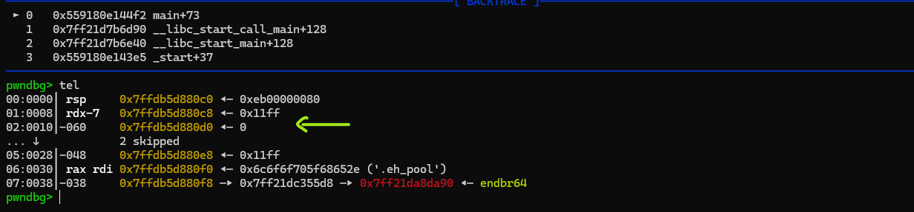

`vec` variable will be stored in stack, since it's reference of `vector<string>` - which will be allocated in heap.

> dont misunderstood this, just imagine its like a pointer (but better)

`vector` now its still empty, so probally `_M_start = _M_finish = _M_end_of_strorage = NULL = 0`, also there is no `vector` was allocated...

> rememeber this is `vector<string>` so when allocated, its will look like some consecutive `"class" string` on the heap...

#### Call `vec.push_back("meh")`

now `_M_finish == _M_end_of_storage`, means that there isnt enough space

so program will allocate `vector` with `size = 1` on heap

and assign values for vector's member of `vec`:

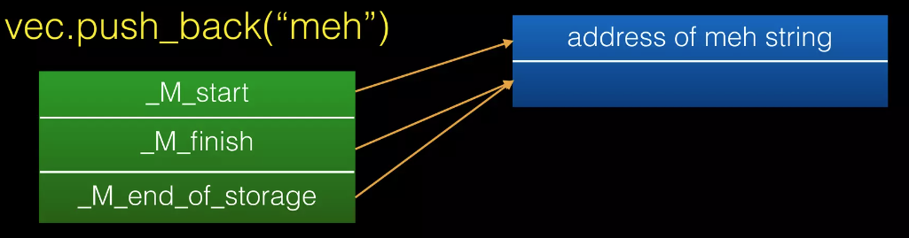

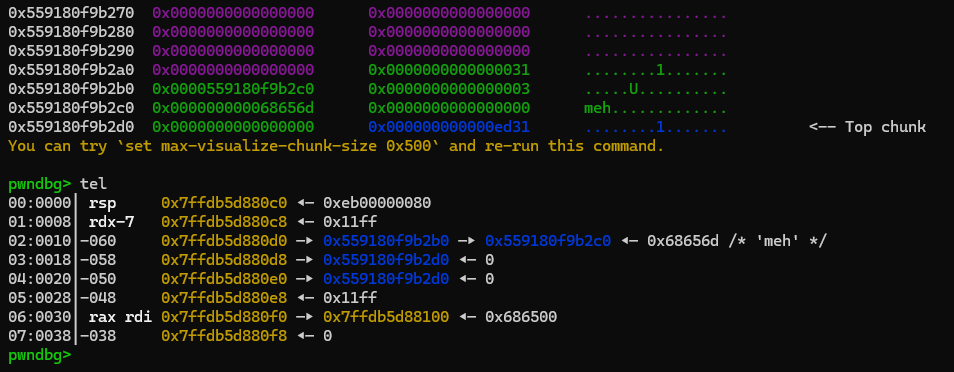

`_M_start` point to address of string `meh`, `_M_finish` and `_M_end_of_storage` point to righ after string `meh` (string means `string` in C++)

#### Call `vec.push_back("meheap")`

now `_M_finish == _M_end_of_storage`, means that there isnt enough space

program will **deallocate** old vector **first**, **then** allocate new one with size bigger (double the previous), `size = 1 * 2 = 2`.

and assign values for vector's member of `vec`:

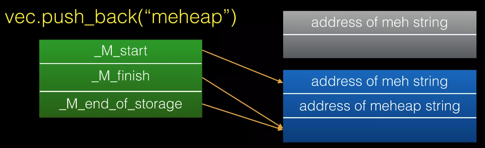

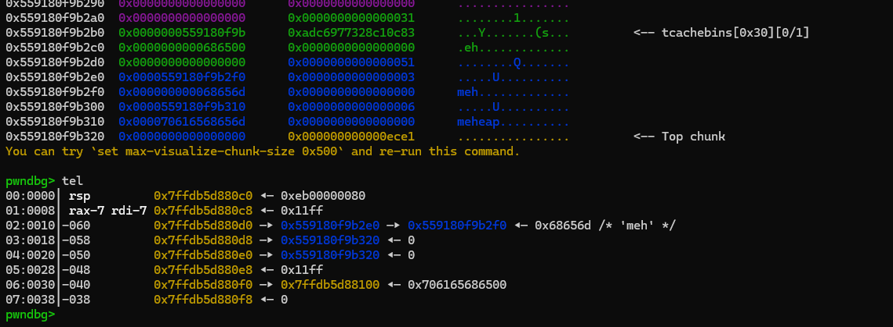

`_M_start` point to address of string `meh` (new one), `_M_finish` and `_M_end_of_storage` point to righ after string `meheap` (string means `string` in C++)

#### Call `vec.push_back("meh.py")`

now `_M_finish == _M_end_of_storage`, means that there isnt enough space

program will **deallocate** old vector **first**, **then** allocate new one with size bigger (double the previous), `size = 2 * 2 = 4`.

and assign values for vector's member of `vec`:

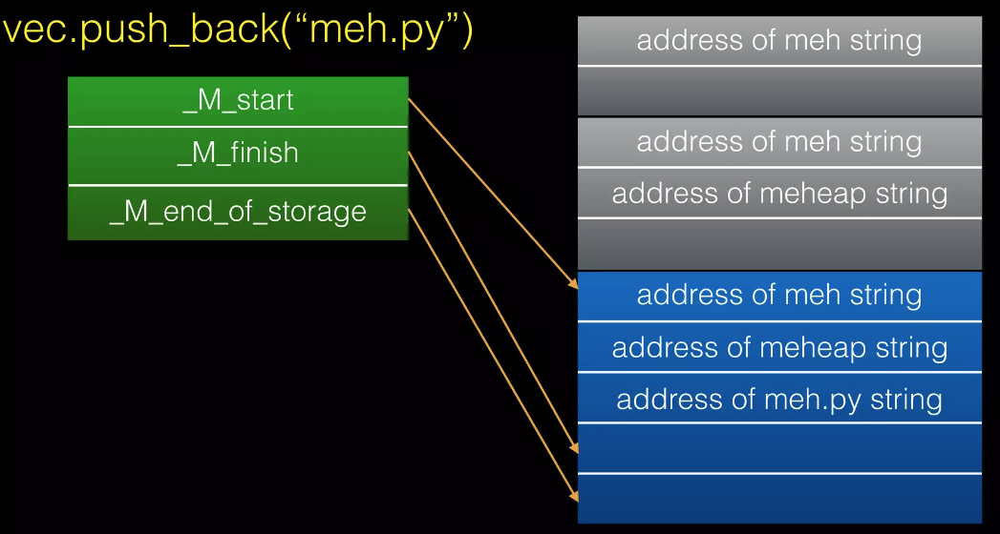

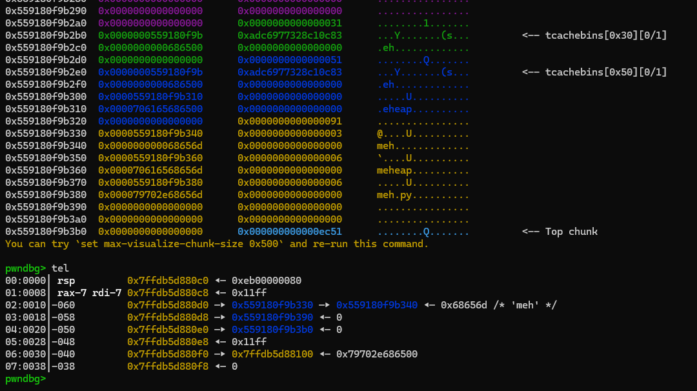

`_M_start` point to address of string `meh` (new one), `_M_finish` point to righ after string `meh.py`, `_M_end_of_storage` point to end of allocated region (string means `string` in C++)

#### Call `vec.push_back("pwn")`

now `_M_finish < _M_end_of_storage`, (number of element is `3` but size is `4`) so enough space to push back

it just simply push the new string after the end of vector (not end of allocate region)

and assign values for vector's member of `vec`:

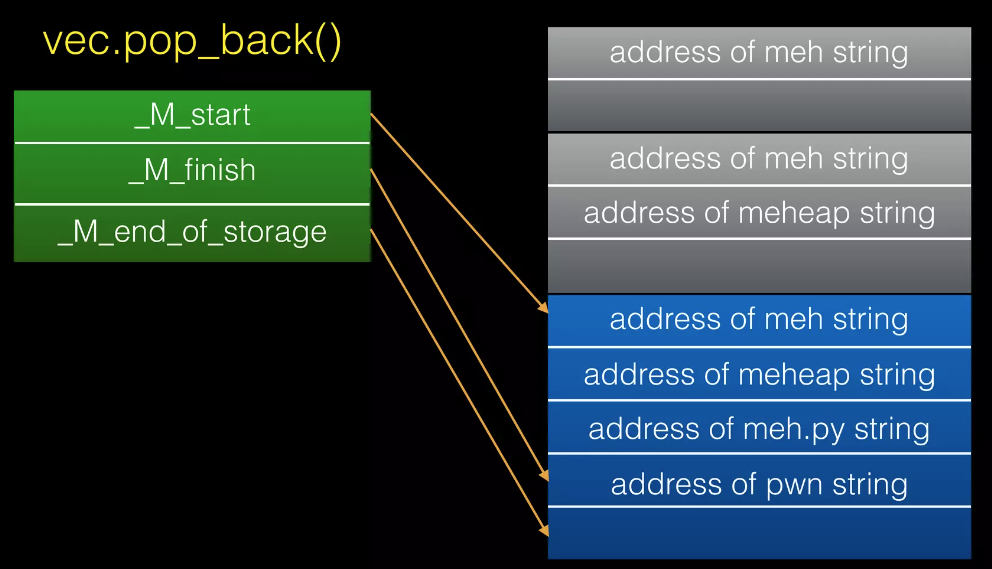

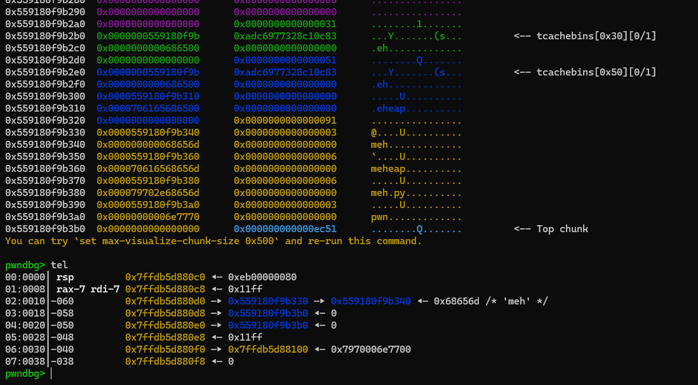

`_M_start` point to address of string `meh`, `_M_finish` and `_M_end_of_storage` point to righ after string `pwn` (string means `string` in C++)

#### Call `vec.pop_back()`

call destructor of `pwn` string and assign values for vector's member of `vec`:


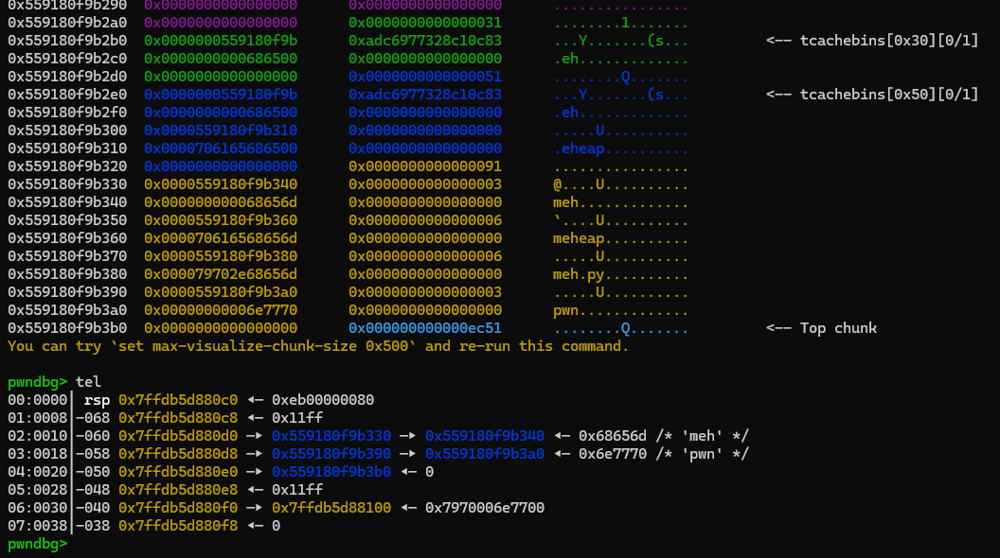

`_M_start` point to address of string `meh`, `_M_finish` point to righ after string `meh.py`, `_M_end_of_storage` point to end of allocated region (string means `string` in C++) (now `size = 3`)

#### Call `vec.push_back("A" * 0x40)`

Just a little test when dealing with big string, you can deeper understand in `string.md`, all the function behaviour as expected (you can guess it ;) ), you can debug it by yourself

## For fun

you will quickly relize how the vector work if you familiar with competitive programing (when you research for vector complexity or internal function), should read this:

https://www.geeksforgeeks.org/cpp/how-does-a-vector-work-in-c/