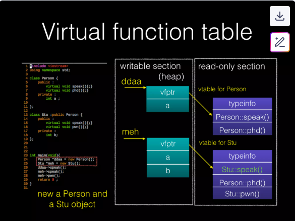
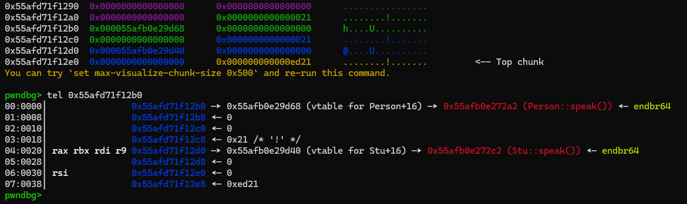
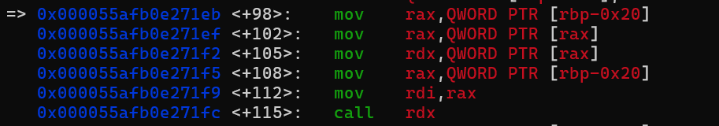
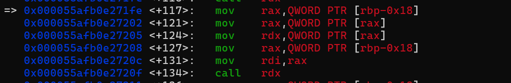
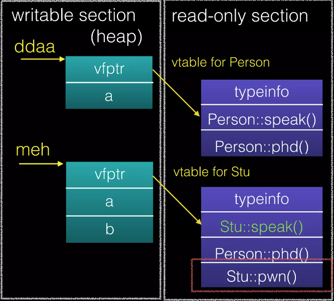
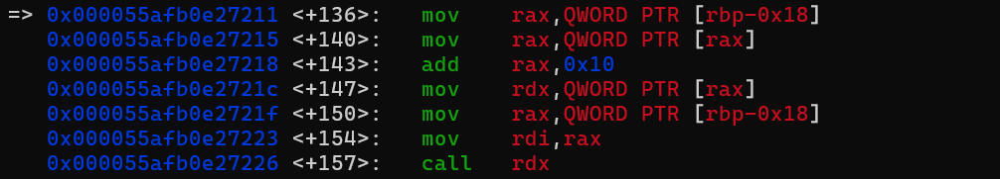
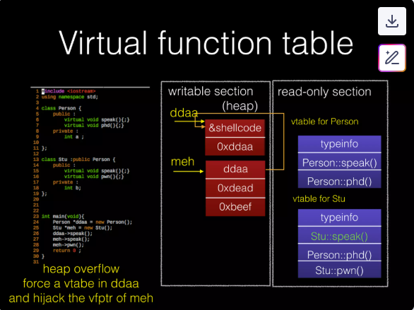

## Virtual Function Table

`vtable` is a key me chanism to support polymorphism (tính đa hình) in C++ (OOP support?)

For each class with virtual functions, depending on the class inheritance hierarchy, the compiler will create one or more associated `vtable`

## Demo

### C++ source code:

```C++
#include <iostream>

using namespace std;

class Person {
    public :
        virtual void speak(){;}
        virtual void phd(){;}
    private :
        int a;
};

class Stu : public Person {
    public :
        virtual void speak(){;}
        virtual void pwn(){;}
    private :
        int b;
};

int main(void){
    Person *ddaa = new Person();
    Stu *meh = new Stu();
    ddaa->speak();
    meh->speak();
    meh->pwn();
    return 0;
}
```

> Compiling by yourself...

### After compiled



compiler generates the table for all the class in read-only section

> vtable of child class Stu will inherit `phd()` from class Person

`new` function depends on `malloc` so `ddaa` and `meh` will exist in heap - writeable section

> and somehow the first QWORDs of class's structs always are the vtable... ?
> 

`vfptr` is short word of "Virtual Function Pointer"

> `vfptr` is **WRITEABLE**

### Calling funtions

When program call `ddaa->speak()`, it's equivalent to:

```
vfptr == *ddaa // (get vfptr)
call *vfptr // (Person::speak(ddaa))
```




When program call `meh->speak()`, it's equivalent to:

```
vfptr == *meh // (get vfptr)
call *vfptr // (Stu::speak(meh))
```




When program call `meh->pwn()`, it's equivalent to:

```
vfptr == *meh // (get vfptr)
call *(vfptr+0x10) // (Stu::pwn(meh))
```





## Vtable hijacking

Need some another vulnerability (UAF, HOF,...) or any primitives that can hijack the vtable.

Because the vtable is writeable -> hijack = rce... example:



- overwrite `vfptr` of `vtable` in `ddaa` (point to shellcode)
- hijack `vfptr` of `vtable` in `meh` (point to `ddaa`)

when program call `meh->speak()`, it's equivalent to:

```
vfptr == *meh // (get vfptr)
call *vfptr // call shellcode(meh)
```

You already familiar with this from FSOP!