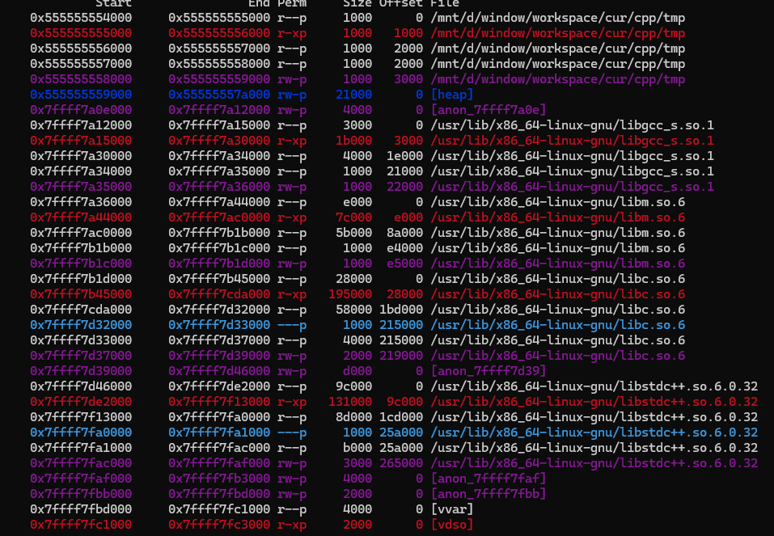

## Compiling

<details>
<summary><strong>Description</strong></summary>
<p>

My OS is `wsl2 ubuntu 22.04.5 LTS`, somehow it already downloaded `g++` compiler. Also i just want to note few things learned here, not testing, so i will only use this `g++` version:

 

</p>
</details>

<details>
<summary><strong>Compiling Libc</strong></summary>
<p>

(update later)

</p>
</details>

<details>
<summary><strong>Compile binaries to linking against to new Libc</strong></summary>
<p>

To compile binaries to link against the compiled libc version:

> Assume that you want to compile a C++ file `tmp.cpp`

```
$ g++ ./tmp.cpp -o tmp
```

Confirm that we are actually using the libc we compiled, it should show something like this:

> I'm using pwndbg



</p>
</details>

