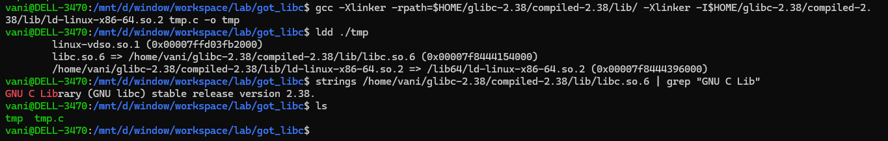
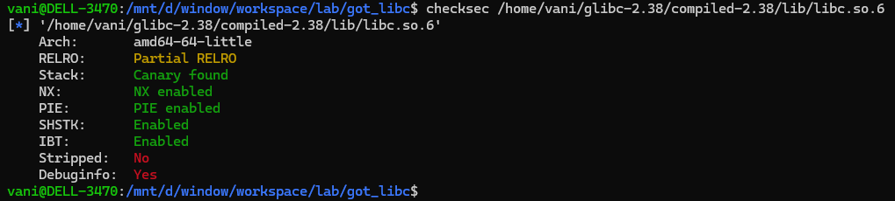
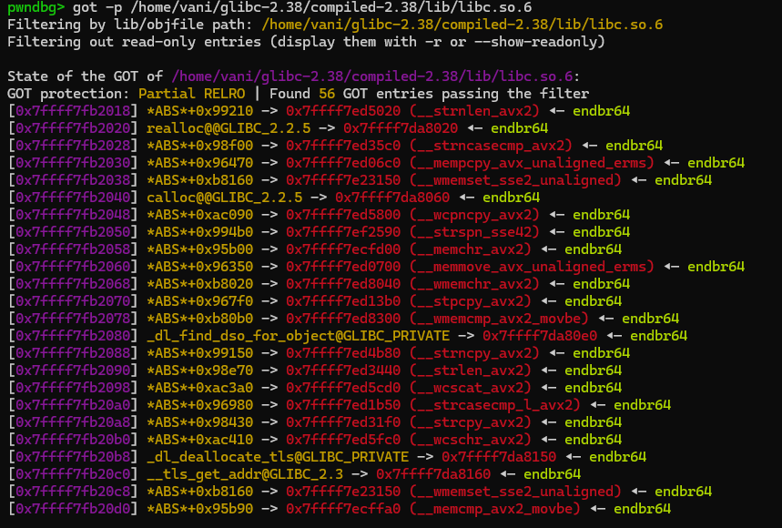
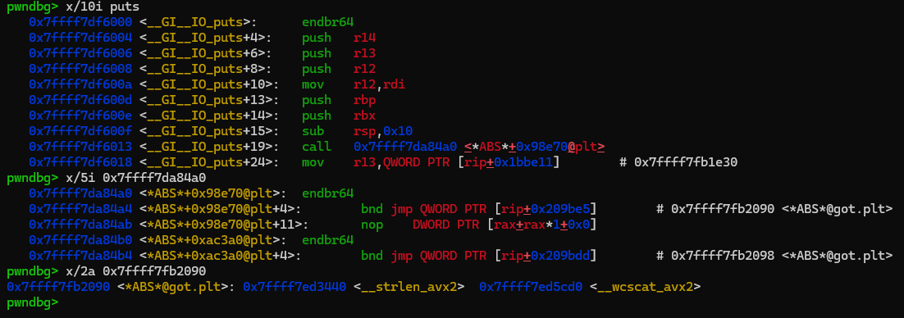
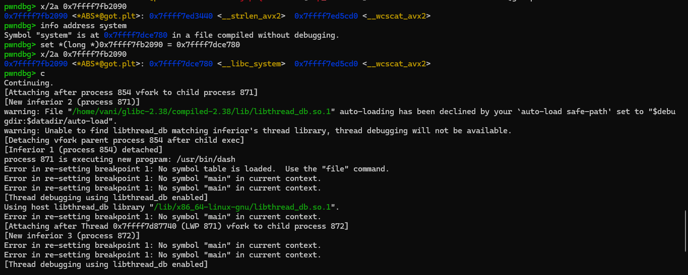
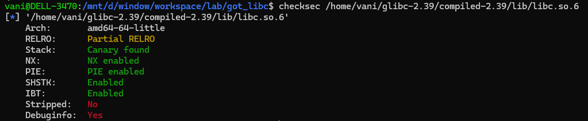

<details>
<summary><strong>Description</strong></summary>
<p>

Assume that you know how the `global offset table` works (basic is enough, no need to deep dive)
> if you familiar with GOT overwrite, this gonna be easy...

</p>
</details>

<details>
<summary><strong>Explain</strong></summary>
<p>

i write a small C program for easier testing:

```c
#include <stdio.h>
#include <stdlib.h>

int main()
{
    puts("/bin/sh");
    return 0;
}
```

then compiled it with libc `2.38` (downloaded on my local):



if you check `libc.so.6` in most linux distro you will see that most (not all) of them use protection Partial Relro:



that means their GOT entries are writable -> a perfect target for code execution...

i used `pwndbg` to navigate the program, set a breakpoint at main, using this command to dump the libc GOT entries:

```
pwndbg> got -p /home/vani/glibc-2.38/compiled-2.38/lib/libc.so.6
```
> remember to change the libc path correct with your set up...

let's have a look to a part of these got entries (as the list is a bit long):



these functions in GOT are called by many other libc functions... To know which GOT entry you should target, you can look at libc disassembly (which i only and usually do...)

for example, libc `puts()` function is calling `__strlen_avx2` (in my global libc `2.38`):



here i modify value at `0x7ffff7fb2090` to `&system`, as a proof of concept, program should execute `system("/bin/sh")` and give shell:



very nice! also, you can put a `one_gadget` there, similar with exploiting `__malloc_hook`/`__free_hook`,...

if your gadget does not pass the contrainst, you should see these blog (very helpful):
- https://github.com/nobodyisnobody/write-ups/tree/main/RCTF.2022/pwn/bfc#code-execution-inferno
- https://robbert1978.github.io/2023/02/27/2023-2-28-Re-Acsc-2023/

</p>
</details>

<details>
<summary><strong>???</strong></summary>
<p>

they said "Libc makes it full RELRO at `2.39` so this skill doesn't work for libc `2.39+`"... but somehow my global libc `2.39` is still partial...



maybe you should checksec again before exploiting, but this is super useful, for current meta...

</p>
</details>

<details>
<summary><strong>Ref</strong></summary>
<p>

- https://github.com/nobodyisnobody/docs/tree/main/code.execution.on.last.libc/#1---targetting-libc-got-entries
- https://github.com/n132/Libc-GOT-Hijacking

</p>
</details>